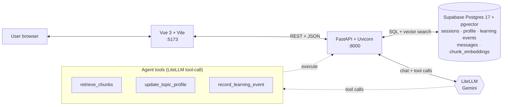

<div align="center">

# AdaptLearn

**An adaptive AI study companion that learns how _you_ learn.**

Pick a topic, drop in your course PDFs, and chat with a tutor that builds a live model of what you know — strengths, gaps, and the one concept worth working on next. Answers are grounded in your own material via RAG, so the tutor cites the page instead of making things up.

[](https://github.com/calmxz/Project_Apt/actions/workflows/ci.yml)
[](LICENSE)
[](https://www.python.org/downloads/)
[](https://vuejs.org/)
[](https://fastapi.tiangolo.com/)
[](https://github.com/pgvector/pgvector)

[**Screencast walkthrough**](docs/screencast/adaptlearn-walkthrough.mp4) · [**Design doc**](docs/superpowers/specs/2026-05-03-adaptlearn-v1-design.md) · [**API spec**](docs/api/openapi.yaml)


</div>

---

## Table of Contents

1. [About](#about)
2. [Features](#features)
3. [Tech Stack](#tech-stack)
4. [Architecture](#architecture)
5. [Prerequisites](#prerequisites)
6. [Installation](#installation)
7. [Configuration](#configuration)
8. [Usage — Your first study session](#usage--your-first-study-session)
9. [API Documentation](#api-documentation)
10. [Folder Structure](#folder-structure)
11. [Common Commands](#common-commands)
12. [Troubleshooting](#troubleshooting)
13. [Roadmap](#roadmap)
14. [Contributing](#contributing)
15. [License](#license)
16. [Acknowledgements](#acknowledgements)

---

## About

Most "AI tutors" today are a chat box bolted onto a generic LLM. They ask the same opening question on turn 1 and turn 100, and they have no idea what you've already mastered. AdaptLearn is different.

**What it does.** You pick a topic ("Discrete Math", "Photosynthesis", "Vector Calculus") and have an ongoing conversation with a tutor agent. Every turn, the agent updates a structured profile of your knowledge — your current level, the gaps you've confirmed, the concepts you've demonstrated mastery of, and the one gap it's currently focused on. The next question is conditioned on that profile, not a blank slate.

**Who it's for.**
- **Students** preparing for an exam who want a tutor that remembers what they already know.
- **Self-learners** working through a textbook who want to be quizzed adaptively, not linearly.
- **Educators / EdTech researchers** interested in tool-augmented LLM tutors with verifiable state.

**Why it exists.** As a 7-week project, AdaptLearn is a demonstration of how structured tool calls and server-side guard rails can keep an LLM honest — no hallucinated mastery, no silent context loss, no fabricated citations.

## Features

- **Live learner profile per topic.** Knowledge level, confirmed gaps, mastered concepts, and one current focus gap. Updated via Pydantic-validated tool calls every turn.
- **Profile demotion on retest failure.** Get a previously mastered concept wrong, and the server removes it from your mastered list. No silent inflation.
- **Focus-clearing guard rail.** The agent cannot clear the current focus without server-verifiable evidence — a `LearningEvent` logged that turn with `correct=true`.
- **PDF → RAG ingestion.** Upload course materials. They're chunked, embedded with `gemini/gemini-embedding-2`, and stored in Supabase Postgres via pgvector. Chat answers cite the source chunk.
- **Server-side retrieval arbitration.** A keyword check decides whether retrieval is _required_; the agent decides whether to call the tool. Two-stage gate keeps it from RAG-ing chitchat.
- **Multi-session, resumable.** Every topic is its own session. Close one with a summary; resume later with prior context restored.
- **Read-only profile views.** Per-session profile (`/profile/:sessionId`) plus a cross-session aggregate dashboard (`/profile`) — see exactly what the model believes about you.
- **Daily rate limit.** Built-in per-user cap (`DAILY_CAP`) so you can't accidentally burn your API quota.
- **Runs natively.** Backend (`uvicorn`) and frontend (`npm run dev`) run locally; Postgres + pgvector and Auth are Supabase-managed. A production Docker stack (`docker-compose.prod.yml`) is provided for deploy.

## Tech Stack

| Layer | Tech | Why |
|---|---|---|
| Frontend | Vue 3, Vite, Pinia, PrimeVue | Reactive SPA, fast dev loop, accessible components out of the box |
| Backend | FastAPI, Uvicorn, Python 3.12 | Typed routes, automatic OpenAPI, async-friendly |
| ORM / DB | SQLAlchemy + Supabase Postgres 17 | Managed Postgres + Alembic migrations; pooled connection via Supabase pgbouncer |
| Vector store | pgvector 0.8.x in Supabase Postgres | Co-located with app schema; `ivfflat` cosine index on `chunk_embeddings` |
| Auth | Supabase Auth (magic-link) | JWT verified server-side against Supabase JWKS |
| LLM gateway | LiteLLM direct | One client, swap providers via env var (Gemini default, Anthropic fallback) |
| LLM | `gemini/gemini-3.1-flash-lite` (chat), `gemini/gemini-embedding-2` (embeddings) | Cheap, fast, large context |
| Tests | pytest, vitest, Playwright | Backend unit/integration, frontend unit, e2e |
| Deploy | Docker Compose; ngrok for public demo | Reproducible local stack; tunneled public preview |

No Firebase. No ADK. No managed cloud lock-in.

## Architecture



### How a turn flows

1. Frontend posts `{session_id, message}` to `POST /api/chat` with an `Authorization: Bearer <jwt>` header (the user id is read from the verified token's `sub` claim, not the body).
2. Backend rebuilds the dynamic part of the system prompt from DB state (current `TopicProfile`, recent messages, ingestion status, server-computed `retrieval_required` flag from a keyword index).
3. LiteLLM forwards the full prompt to Gemini. Gemini may emit tool calls.
4. Backend executes each tool call:
   - `retrieve_chunks` → pgvector cosine search, returns top-_k_ chunks with citations.
   - `update_topic_profile` → Pydantic-validated patch over the profile row.
   - `record_learning_event` → insert a LearningEvent row; trigger mastery demotion if applicable.
5. Tool results go back to Gemini, which produces the final assistant message.
6. Backend persists the user + assistant messages and returns `{assistant_message, message_id, tool_calls, citations}` to the frontend.

The agent has three tools, no more:

| Tool | Purpose |
|---|---|
| `retrieve_chunks(session_id, query, k=5)` | pgvector cosine search over the user's uploaded PDF chunks |
| `update_topic_profile(...)` | Patch the learner's topic profile; clearing `focus_target_gap` requires `focus_clear_reason` |
| `record_learning_event(session_id, gap_tested, question, correct)` | Logs check-question outcomes; incorrect retest on a mastered concept demotes it server-side |

The system prompt is split: an immutable rules block (`backend/agent/prompts.py`) plus dynamic context rebuilt per turn. Splitting keeps the immutable half cache-friendly. Full detail in [the design doc §3.3](docs/superpowers/specs/2026-05-03-adaptlearn-v1-design.md).

## Prerequisites

Local development runs the app natively (Postgres + pgvector and Auth are Supabase-managed, so there is no local DB container):

- Python 3.12 (`python --version`)
- Node.js 20.x or newer + npm 10.x (`node --version`, `npm --version`)
- For RAG (PDF upload + retrieval): a Supabase Postgres connection string in `DATABASE_URL`. Without it the backend falls back to a local SQLite file (`sqlite:///./data/app.db`) — fine for a quick spin, but pgvector retrieval requires Postgres.

> Docker is only used for the production / public-demo stack (`docker-compose.prod.yml`). The root `docker-compose.yml` is a no-op anchor and runs nothing.

### You also need

- A **Gemini API key**. Free tier is fine for personal use. Get one here:
  1. Open [Google AI Studio](https://aistudio.google.com/apikey).
  2. Sign in with a Google account.
  3. Click **Create API key**. Copy the value (starts with `AIza...`).
  4. Keep it private. You'll paste it into `.env` in the next section.

## Installation

### 1. Clone the repo

```bash
git clone https://github.com/calmxz/Project_Apt.git
cd Project_Apt
```

### 2. Create your `.env`

```bash
cp .env.example .env
```

Open `.env` in your editor. At minimum set your Gemini key; for real use (RAG + auth) also point at your Supabase project:

```ini
GEMINI_API_KEY=AIza...your-key-here...
# For RAG + Supabase Auth (omit DATABASE_URL to use the local SQLite fallback):
DATABASE_URL=postgresql://...your-supabase-pooler-uri...
SUPABASE_URL=https://your-project.supabase.co
```

See the [Configuration](#configuration) section for the full variable reference.

### 3. Run the app locally

**Backend** — from `backend/`:

```bash
python -m venv .venv

# Windows PowerShell:
.venv\Scripts\Activate.ps1
# macOS / Linux:
source .venv/bin/activate

pip install -e .[dev]
uvicorn main:app --reload
```

Or from the repo root: `uvicorn main:app --reload --app-dir backend`. `config.py` anchors `.env` and `data/` to the repo root, so cwd doesn't matter. `data/uploads/` auto-creates on first boot (plus `data/app.db` if you're on the SQLite fallback). Postgres + pgvector live in Supabase — there's no local DB to start.

**Frontend** — from `frontend/`:

```bash
npm install
cp .env.example .env.local       # adjust VITE_API_BASE_URL if backend isn't on :8000
npm run dev
```

Visit http://localhost:5173.

> **Deploying?** The production / public-demo stack (nginx-served frontend + uvicorn backend) lives in `docker-compose.prod.yml`. Run it from the repo root with `docker compose -f docker-compose.prod.yml --env-file .env up --build`, then expose port 80 (e.g. `ngrok http 80`).

### 4. Verify everything is healthy

```bash
curl http://localhost:8000/health
# → {"status":"ok"}
```

If you get `connection refused`, the backend didn't come up. Check the logs.

## Configuration

The backend reads `.env` at the repo root. For the production stack, the same `.env` is passed via `--env-file` (see `docker-compose.prod.yml`).

### Required

| Variable | Purpose | Example |
|---|---|---|
| `GEMINI_API_KEY` | LiteLLM credential for Gemini. Get one at [Google AI Studio](https://aistudio.google.com/apikey). | `AIza...` |

### Optional (have sensible defaults)

| Variable | Purpose | Default |
|---|---|---|
| `MODEL` | LiteLLM-prefixed chat model id. Swap to `anthropic/claude-sonnet-4-6` if reliability checkpoints fail. | `gemini/gemini-3.1-flash-lite` |
| `EMBEDDING_MODEL` | Embedding model used by pgvector ingestion + retrieval. | `gemini/gemini-embedding-2` |
| `DAILY_CAP` | Per-user daily request cap. | `50` |
| `DATABASE_URL` | SQLAlchemy connection string (Supabase pooler URI; bare `postgresql://` auto-converted to `postgresql+psycopg://`). | `sqlite:///./data/app.db` (legacy default; Phase 7+ requires Supabase Postgres URL) |
| `EMBEDDING_DIM` | Vector dimension for `chunk_embeddings`. Must match the migration; changing requires re-embedding. | `768` |
| `SUPABASE_URL` | Project URL — used to derive JWKS endpoint for JWT verification. | — |
| `SUPABASE_SECRET_KEY` | Backend-only secret API key (`sb_secret_…`; replaces legacy `service_role` per Supabase 2025 key model). | — |
| `LLM_SOFT_CAP_USD` / `LLM_HARD_CAP_USD` | Per-user daily LLM spend thresholds (soft = warning header, hard = 429). | `2.00` / `3.00` |

### Frontend `.env.local`

| Variable | Purpose | Default |
|---|---|---|
| `VITE_API_BASE_URL` | Backend base URL the SPA calls. | `http://localhost:8000` |

> **Security.** `.env` and `.env.local` are gitignored. **Never commit your `GEMINI_API_KEY`** — if you do, rotate it immediately at [Google AI Studio](https://aistudio.google.com/apikey).

## Usage — Your first study session

With the stack running on http://localhost:5173, here's the end-to-end happy path. Screenshots are placeholders — replace with your own captures.

### 1. Onboarding


On first visit you'll see a short onboarding flow. Enter a display name (it doubles as your `user_id` for local single-user use). Click **Continue**.

### 2. The home dashboard


The home view (`HomeView`) shows:
- Your existing sessions, grouped active vs ended.
- A **New session** button.
- A **Profile** link to the cross-session aggregate dashboard.

### 3. Start a new session


Click **New session**. Enter:
- **Topic** — what you want to study (e.g. `"Linear Algebra: Eigenvalues"`).
- **Seed mode** — `fresh` (no prior context) or `resume` (carry over a prior session's profile).

Click **Start**. You're dropped into the chat view with an empty profile.

### 4. Optionally attach a PDF


Inside a session, click the **paperclip** icon to upload a PDF. The backend:
1. Returns `202 Accepted` immediately with a `document_id`.
2. Runs chunking + embedding in the background.
3. The UI polls `GET /api/upload/{document_id}` until status flips from `pending` → `ready` (or `failed`).

Once `ready`, the agent can call `retrieve_chunks` on this material. Subsequent answers will include **citations** rendered as a list under the message.

### 5. Chat


Type a message. The tutor will:

- Ask a calibrating question if the profile is empty.
- Acknowledge what you say, update its model of you, and ask a follow-up.
- Quiz you on a gap when it has enough signal.
- Cite a PDF chunk when the answer is grounded in uploaded material.

Behind the scenes (visible in the dev console as `tool_calls`), it might call e.g.:

```jsonc
{ "name": "update_topic_profile",
  "args": { "session_id": "s_42", "knowledge_level": "intermediate",
            "add_confirmed_gap": "computing eigenvectors by hand",
            "evidence_type": "declared" } }
```

### 6. Check your profile


Click the **profile icon** in the session header to open `ProfileView` (`/profile/:sessionId`). You'll see:

- Current `knowledge_level`.
- All `confirmed_gaps` (chips).
- All `mastered_concepts` (chips).
- The `focus_target_gap` highlighted.
- The last 20 `LearningEvent` rows (question, gap tested, correct/incorrect).

### 7. End the session


Click **End session**. The backend calls `POST /api/sessions/:id/end`, which generates a one-paragraph summary via the LLM. The session is now read-only.

You can reopen it later via `POST /api/sessions/:id/reopen` (UI button on the ended-session banner).

### 8. Cross-session dashboard


Back on the home dashboard, click **Profile** to see `AggregateProfileView`. This is a pure SQL/Python aggregate — no LLM calls — showing:

- Total / active / ended session counts.
- Combined mastered concepts and gaps across every session (sorted by frequency).
- Knowledge level distribution across topics.
- Recent topics.

This is the dashboard for "what am I learning, overall?"

### 9. Example: a complete chat turn

```jsonc
// POST /api/chat
// Header: Authorization: Bearer <supabase-jwt>   (the user id comes from the token)
{
  "session_id": "s_42",
  "message": "I get how dot products work, but cross products confuse me."
}

// Response
{
  "assistant_message": "Good — let's pin that down. Cross products only live in 3D. Can you tell me what the *direction* of u × v is relative to u and v?",
  "message_id": 87,
  "tool_calls": [
    {
      "name": "update_topic_profile",
      "args": {
        "session_id": "s_42",
        "add_confirmed_gap": "cross product geometric meaning",
        "focus_target_gap": "cross product geometric meaning",
        "evidence_type": "declared"
      },
      "status": "ok"
    }
  ],
  "citations": []
}
```

## API Documentation

The HTTP contract lives in [`docs/api/openapi.yaml`](docs/api/openapi.yaml). Pydantic models under `backend/contracts/` are **generated** from that file — never hand-edit them. Regenerate with:

```bash
python backend/scripts/gen_contracts.py
```

CI enforces zero drift between the YAML and the generated package.

> **Authentication.** Every `/api/*` route requires a Supabase magic-link JWT sent as `Authorization: Bearer <jwt>`. The backend verifies it against Supabase JWKS and reads the user id from the token's `sub` claim — `user_id` is never accepted from the request body or query string. Requests without a valid token get `401`.

### Endpoint summary

#### Health

| Method | Path | Description |
|---|---|---|
| GET | `/health` | Liveness probe. Returns `{"status":"ok"}`. |

#### Chat

| Method | Path | Description |
|---|---|---|
| POST | `/api/chat` | Send a user message; receive tutor response with tool calls + citations. |

#### Sessions

| Method | Path | Description |
|---|---|---|
| POST | `/api/sessions` | Create a fresh or resumed session. |
| GET | `/api/sessions` | List sessions for the authenticated user (from the bearer token). |
| GET | `/api/sessions/{session_id}` | Get session detail + full message transcript. |
| POST | `/api/sessions/{session_id}/end` | End the session; generate summary. |
| POST | `/api/sessions/{session_id}/reopen` | Reopen an ended session. |

#### Upload (PDF / RAG)

| Method | Path | Description |
|---|---|---|
| POST | `/api/upload` | Upload a PDF (multipart, fields: `session_id`, `file`). Returns `202` immediately; ingestion runs in background. |
| GET | `/api/upload/{document_id}` | Poll ingestion status (`pending` / `ready` / `failed`). |

#### Profile

| Method | Path | Description |
|---|---|---|
| GET | `/api/profile/{session_id}` | Get a session's TopicProfile + recent LearningEvents. |
| GET | `/api/profile/aggregate` | Cross-session aggregate dashboard for the authenticated user. Pure SQL/Python, no LLM calls. |

### Common error responses

| Status | Meaning |
|---|---|
| 400 | Malformed request (validation failure). |
| 401 | Missing or invalid bearer token. |
| 404 | Resource not found. |
| 429 | Daily rate limit (`DAILY_CAP`) reached. |
| 503 | LLM provider unavailable / timeout. |

All errors return `{"detail": "<message>"}`.

### Example: curl a chat turn

```bash
# All /api routes need a Supabase JWT. Capture yours from the SPA (it's the
# Supabase session access token) and pass it as a bearer token.
TOKEN="<your-supabase-jwt>"

# Create a session
curl -X POST http://localhost:8000/api/sessions \
  -H "Authorization: Bearer $TOKEN" \
  -H "Content-Type: application/json" \
  -d '{"topic":"Eigenvalues","seed_mode":"fresh"}'

# → {"id":"s_42", "user_id":"<token sub>", "topic":"Eigenvalues", "topic_profile":{...}, ...}

# Send a message
curl -X POST http://localhost:8000/api/chat \
  -H "Authorization: Bearer $TOKEN" \
  -H "Content-Type: application/json" \
  -d '{"session_id":"s_42","message":"What is an eigenvalue?"}'
```

### Interactive docs

With the backend running, FastAPI's interactive docs are available at:

- Swagger UI → http://localhost:8000/docs
- ReDoc → http://localhost:8000/redoc

## Folder Structure

```
Project_Apt/
├── docs/
│   ├── superpowers/specs/      Design doc (source of truth)
│   ├── superpowers/plans/      Phase implementation plans
│   ├── api/openapi.yaml        API contract (codegen source)
│   ├── deploy/ngrok.md         Public demo deploy guide
│   ├── screencast/             Walkthrough script + recorded video
│   ├── AdaptLearn_Spec.md      Original spec (v2 reference)
│   └── AdaptLearn_DevPlan.md   Original dev plan (v2 reference)
├── spike/                      Phase 0 validation spike (preserved)
├── frontend/
│   ├── src/
│   │   ├── views/              HomeView, NewSessionView, SessionView,
│   │   │                       ProfileView, AggregateProfileView,
│   │   │                       OnboardingView, SettingsView
│   │   ├── components/         BackButton, EmptyState, Logo,
│   │   │                       SessionEndedBanner
│   │   ├── stores/             Pinia stores
│   │   ├── api/                Backend client (axios)
│   │   └── router/             Vue Router config
│   ├── tests/                  vitest + Playwright
│   └── package.json
├── backend/
│   ├── main.py                 FastAPI app entrypoint
│   ├── config.py               Settings (.env loader, paths)
│   ├── agent/
│   │   ├── tutor.py            TutorAgent — LiteLLM tool-call loop
│   │   ├── prompts.py          Immutable system prompt
│   │   └── tools.py            Tool schemas + dispatch
│   ├── routes/                 health, chat, sessions, upload, profile
│   ├── services/               auth, profile, retrieval, ingestion, summary, rate_limit, cost_meter
│   ├── db/                     models.py (SQLAlchemy), database.py
│   ├── contracts/              GENERATED Pydantic DTOs (do not edit)
│   ├── scripts/gen_contracts.py  Codegen wrapper
│   ├── lib/                    keyword_index, chunking
│   └── tests/                  pytest
├── data/                       Local volume: uploads/ (PDFs). DB + vectors live in Supabase (app.db only on the SQLite fallback)
├── docker-compose.yml          No-op anchor (Phase 7+: no local infra in Docker)
├── docker-compose.prod.yml     Prod / public demo stack
├── .github/workflows/ci.yml    pytest + vitest + playwright
├── .env.example
├── LICENSE
└── README.md                   ← you are here
```

## Common Commands

| Task | Command |
|---|---|
| Start backend (dev) | from `backend/`: `uvicorn main:app --reload` (or repo root: `uvicorn main:app --reload --app-dir backend`) |
| Start frontend (dev) | from `frontend/`: `npm run dev` |
| Build + run prod stack | from repo root: `docker compose -f docker-compose.prod.yml --env-file .env up --build` |
| Backend tests | from `backend/`: `pytest` |
| Single backend test | from `backend/`: `pytest tests/test_foo.py::test_bar` |
| Regenerate API contracts | from repo root: `python backend/scripts/gen_contracts.py` |
| Frontend unit tests | from `frontend/`: `npm run test:unit -- --run` |
| Frontend e2e (Playwright) | from `frontend/`: `npm run test:e2e` |
| Lint / format frontend | from `frontend/`: `npm run lint` / `npm run format` |

## Troubleshooting

<details>
<summary><b><code>connection refused</code> on localhost:8000</b></summary>

Backend isn't up. Check the `uvicorn` output for the error. Common causes: missing `GEMINI_API_KEY` in `.env`, port 8000 already in use.
</details>

<details>
<summary><b>pgvector / Supabase connection errors on startup or upload</b></summary>

RAG retrieval needs a Supabase Postgres connection. Common causes:

- `DATABASE_URL` not set (the backend silently falls back to local SQLite, which has no pgvector — uploads will fail to embed) or pointing at the wrong project/pooler URI.
- Vector dimension mismatch: `EMBEDDING_DIM` (default `768`) must match the `chunk_embeddings` column created by the Alembic migration. Changing it requires re-running migrations and re-embedding.
- pgvector extension not enabled on the Supabase project. See [`docs/db/postgres-pgvector-setup.md`](docs/db/postgres-pgvector-setup.md).
</details>

<details>
<summary><b>429 Too Many Requests from the chat endpoint</b></summary>

You've hit `DAILY_CAP`. Either bump the value in `.env` and restart the backend, or wait until the daily counter resets.
</details>

<details>
<summary><b>503 Upstream Unavailable</b></summary>

Gemini is timing out or your `GEMINI_API_KEY` is invalid. Check your key at [Google AI Studio](https://aistudio.google.com/apikey). If the key is fine, Gemini may be experiencing an outage — retry shortly.
</details>

<details>
<summary><b>PDF stuck in <code>pending</code> forever</b></summary>

Ingestion runs in a background task. Check the backend (`uvicorn`) output for embedding errors. Common causes: scanned-image PDF (no extractable text), bad `EMBEDDING_MODEL` value, Gemini quota exhausted.
</details>

<details>
<summary><b>Frontend shows <code>Network Error</code></b></summary>

`VITE_API_BASE_URL` in `frontend/.env.local` doesn't match where the backend is listening. Default is `http://localhost:8000` — fix accordingly if you changed the backend port.
</details>

<details>
<summary><b>Contracts drift CI failure</b></summary>

You edited `backend/contracts/` by hand or forgot to regenerate after editing `docs/api/openapi.yaml`. Run:

```bash
python backend/scripts/gen_contracts.py
git add backend/contracts/
git commit
```
</details>

## Roadmap

AdaptLearn v1 is feature-complete for its 7-week scope. Possible v2 directions:

- **Multi-user auth.** Real accounts (OAuth, magic-link) instead of single-user local mode.
- **Mobile-friendly redesign.** The current SPA is desktop-first; an adaptive layout for phones is on the wishlist.
- **Voice mode.** STT in, TTS out — quiz yourself while walking.
- **Spaced repetition.** Surface previously confirmed gaps for review at SR intervals.
- **Image / diagram support.** Let the tutor render or accept diagrams (graph theory, geometry, circuits).
- **Cloud deploy template.** Terraform module for AWS / GCP / Fly.io.
- **Provider matrix.** First-class support for Anthropic, OpenAI, and local models (Ollama) via LiteLLM.

If you want to tackle one of these, see [Contributing](#contributing).

## Contributing

Contributions welcome — bug reports, fixes, docs improvements, and feature work.

### Bug reports

Open an issue with:

- A short title.
- Steps to reproduce (smallest possible repro).
- Expected vs actual behaviour.
- Stack / version info (OS, Docker version, browser).
- Relevant log excerpts.

### Pull request flow

1. Fork the repo and create a feature branch:
   ```bash
   git checkout -b feat/your-feature-name
   ```
2. Make your change. Follow the existing code style:
   - Backend: ruff-compatible Python, type hints where they help.
   - Frontend: ESLint clean (`npm run lint`), Prettier formatted (`npm run format`).
   - No emojis in code or comments.
3. Add or update tests:
   - Backend → `backend/tests/`
   - Frontend → `frontend/src/**/__tests__/` or `frontend/tests/`
4. Run the full test suite locally:
   ```bash
   # Backend
   cd backend && pytest
   # Frontend
   cd frontend && npm run test:unit -- --run
   ```
5. **If you touched the API contract:** edit `docs/api/openapi.yaml` first, then run `python backend/scripts/gen_contracts.py`. Commit the regenerated `backend/contracts/` package together with your YAML change.
6. Commit with [Conventional Commits](https://www.conventionalcommits.org/) style:
   - `feat(backend): add streaming chat endpoint`
   - `fix(frontend): handle 429 in session view`
   - `docs: clarify pgvector setup step`
7. Push and open a PR. Describe **what** changed, **why**, and any caveats.

### Branch naming

| Prefix | Purpose |
|---|---|
| `feat/<slug>` | New feature |
| `fix/<slug>` | Bug fix |
| `docs/<slug>` | Docs-only |
| `refactor/<slug>` | Internal change, no behaviour difference |
| `chore/<slug>` | Tooling / dependency bumps |

### Ground rules

- No emojis in code or comments.
- Secrets in `.env` / `.env.local` (gitignored). Never commit keys.
- Stop and report on any failed verification step — don't hide a red test.
- The design doc (`docs/superpowers/specs/`) is the source of truth. If docs disagree, flag the conflict in your PR.

## License

Distributed under the **MIT License**. See [LICENSE](LICENSE) for the full text.

© 2026 calmxz

## Acknowledgements

AdaptLearn stands on the shoulders of a lot of excellent open-source work:

- [**FastAPI**](https://fastapi.tiangolo.com/) — backend framework.
- [**Vue 3**](https://vuejs.org/) + [**Vite**](https://vitejs.dev/) + [**Pinia**](https://pinia.vuejs.org/) + [**PrimeVue**](https://primevue.org/) — frontend stack.
- [**LiteLLM**](https://github.com/BerriAI/litellm) — provider-agnostic LLM client.
- [**pgvector**](https://github.com/pgvector/pgvector) on [**Supabase Postgres**](https://supabase.com/) — vector search co-located with the app schema.
- [**SQLAlchemy**](https://www.sqlalchemy.org/) — ORM.
- [**pytest**](https://docs.pytest.org/) + [**vitest**](https://vitest.dev/) + [**Playwright**](https://playwright.dev/) — test runners.
- **Google Gemini** — chat + embedding model.

Architecture inspiration: structured-state LLM tutors as discussed in recent EdTech-LLM research papers, and the broader "tool-augmented agent with verifiable state" pattern that's emerged through 2025.

Built as a 7-week project. Phase plan and design rationale live in [`docs/superpowers/`](docs/superpowers/).
