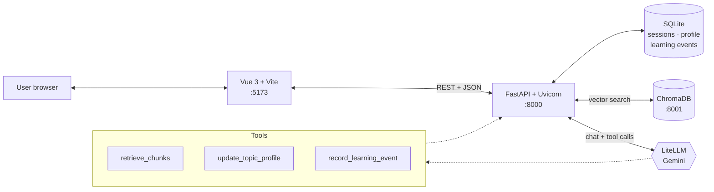

<div align="center">

# AdaptLearn

**An adaptive AI study companion that learns how _you_ learn.**

Pick a topic, drop in your course PDFs, and chat with a tutor that builds a live model of what you know — strengths, gaps, and the one concept worth working on next. Grounded in your own material via RAG, so it cites the page instead of making things up.

[](https://github.com/calmxz/Project_Apt/actions/workflows/ci.yml)
[](LICENSE)
[](https://www.python.org/downloads/)
[](https://vuejs.org/)
[](https://fastapi.tiangolo.com/)

[**Screencast walkthrough**](docs/screencast/adaptlearn-walkthrough.mp4) · [**Design doc**](docs/superpowers/specs/2026-05-03-adaptlearn-v1-design.md) · [**API spec**](docs/api/openapi.yaml)


</div>

---

## Why this exists

Most "AI tutors" are a chat box bolted onto a generic LLM — they ask the same opening question on turn 1 and turn 100, and they have no idea what you've already mastered. AdaptLearn keeps a structured profile per topic (knowledge level, confirmed gaps, mastered concepts, current focus) and updates it through tool calls every turn. The next question is always conditioned on what the model actually knows about you.

It also refuses to hallucinate citations. PDF chunks live in ChromaDB; retrieval is arbitrated server-side by a keyword index before the agent is even told it _may_ retrieve.

## Features

- **Live learner profile** — knowledge level + gaps + mastered concepts + a single in-focus gap, updated via Pydantic-validated tool calls per turn.
- **Profile demotion on retest failure** — get a previously mastered concept wrong, and the server removes it. No silent inflation.
- **Focus-clearing guard rail** — the agent cannot clear the current focus without server-verifiable evidence (a logged correct `LearningEvent` that turn).
- **PDF → RAG ingestion** — upload course materials; chunked, embedded, and stored in ChromaDB. Answers cite the source chunk.
- **Server-side retrieval arbitration** — keyword check decides whether retrieval is _required_; the agent then decides whether to call the tool.
- **Multi-session, resumable** — every topic is its own session with summary on close and resume on open.
- **Read-only profile view** — see exactly what the model believes about you per topic.

## Architecture



One **TutorAgent** running through LiteLLM direct. Three tools:

| Tool | Purpose |
|---|---|
| `retrieve_chunks(session_id, query, k=5)` | ChromaDB vector search over the user's uploaded PDFs |
| `update_topic_profile(...)` | Pydantic-validated patch over the learner's topic profile |
| `record_learning_event(session_id, gap_tested, question, correct)` | Logs check-question outcomes; incorrect retest on a mastered concept demotes it server-side |

The system prompt is split: immutable rules (`backend/agent/prompts.py`) plus dynamic context rebuilt per turn. Splitting keeps the immutable half cache-friendly. Full detail in [the design doc §3.3](docs/superpowers/specs/2026-05-03-adaptlearn-v1-design.md).

## Stack

| Layer | Tech |
|---|---|
| Frontend | Vue 3, Vite, Pinia, PrimeVue |
| Backend | FastAPI, Uvicorn, Python 3.12, SQLAlchemy |
| Vector store | ChromaDB 1.5.x |
| LLM | Gemini via LiteLLM direct — `gemini/gemini-3.1-flash-lite` for chat, `gemini-embedding-2` for embeddings |
| Tests | pytest, vitest, Playwright (e2e) |
| Deploy | Docker Compose; ngrok for public demo |

No Firebase. No ADK. No cloud lock-in.

## Quick Start

### Docker (recommended)

```bash
cp .env.example .env          # then fill in GEMINI_API_KEY
docker compose up             # add --build after Dockerfile or deps changes
```

Then visit:

- Frontend → http://localhost:5173
- Backend API → http://localhost:8000 (health: `/health`, chat: `POST /api/chat`)
- ChromaDB → http://localhost:8001

Common variants:

```bash
docker compose up -d                       # detached
docker compose up backend                  # backend + chromadb only
docker compose logs -f backend             # tail backend
docker compose exec backend pytest -v      # run tests inside container
docker compose down                        # stop; ./data persists
docker compose down -v                     # also drop named volumes
```

Bind mount `./data` ↔ `/data`: SQLite, uploads, and Chroma persistence all live there and survive restarts. Detailed reference: [`backend/README.md`](backend/README.md#docker).

### Local development (no Docker)

**Backend** — from `backend/`:

```bash
python -m venv .venv
.venv\Scripts\activate           # Windows; source .venv/bin/activate elsewhere
pip install -e .[dev]
uvicorn main:app --reload
```

Or from repo root: `uvicorn main:app --reload --app-dir backend`. `config.py` anchors `.env` and `data/` to the repo root, so cwd doesn't matter. `data/app.db`, `data/chroma/`, `data/uploads/` auto-create on first boot.

**Frontend** — from `frontend/`:

```bash
npm install
cp .env.example .env.local       # adjust VITE_API_BASE_URL if backend not on :8000
npm run dev
```

## Configuration

Backend reads `.env` at the repo root (mounted into the container via `env_file`):

| Var | Purpose |
|---|---|
| `GEMINI_API_KEY` | LiteLLM credential for Gemini |
| `MODEL` | Chat model id (default `gemini/gemini-3.1-flash-lite`) |
| `EMBEDDING_MODEL` | Embedding model id (default `gemini-embedding-2`) |
| `DAILY_CAP` | Per-user daily request cap (rate limiter) |

Container-only overrides set in `docker-compose.yml`: `DATABASE_URL`, `CHROMA_HOST`, `CHROMA_PORT`.

## Common Commands

| Task | Command |
|---|---|
| Start full stack | `docker compose up` |
| Rebuild backend image | `docker compose build backend` |
| Backend logs | `docker compose logs -f backend` |
| Shell into backend container | `docker compose exec backend bash` |
| Stop stack | `docker compose down` |
| Backend tests (local) | from `backend/`: `pytest` |
| Backend tests (container) | `docker compose exec backend pytest -v` |
| Single backend test | from `backend/`: `pytest tests/test_foo.py::test_bar` |
| Regenerate API contracts | from repo root: `python backend/scripts/gen_contracts.py` |
| Frontend dev server | from `frontend/`: `npm run dev` |
| Frontend unit tests | from `frontend/`: `npm run test:unit -- --run` |
| Lint / format | from `frontend/`: `npm run lint` / `npm run format` |

## Repository Layout

```
Project_Apt/
├── docs/
│   ├── superpowers/specs/      Design doc (source of truth)
│   ├── superpowers/plans/      Phase implementation plans
│   ├── api/openapi.yaml        API contract (Pydantic codegen source)
│   ├── deploy/ngrok.md         Public demo deploy guide
│   ├── screencast/             Walkthrough script + recorded video
│   ├── AdaptLearn_Spec.md      Original spec (v2 reference)
│   └── AdaptLearn_DevPlan.md   Original dev plan (v2 reference)
├── spike/                      Phase 0 validation spike (preserved)
├── frontend/                   Vue 3 + Vite + PrimeVue + Pinia
├── backend/                    FastAPI + SQLite + ChromaDB
│   ├── main.py
│   ├── agent/                  tutor.py, prompts.py, tools.py
│   ├── routes/                 chat.py, sessions.py, upload.py, profile.py
│   ├── services/               profile, retrieval, ingestion, summary, rate_limit
│   ├── db/                     models.py, database.py (SQLAlchemy ORM)
│   ├── contracts/              GENERATED Pydantic DTOs (do not edit — see docs/api/openapi.yaml)
│   ├── scripts/gen_contracts.py  Codegen wrapper for contracts/
│   ├── lib/                    keyword_index.py, chunking.py
│   └── tests/
├── data/                       Persisted volumes (sqlite, uploads, chroma)
├── docker-compose.yml
├── docker-compose.prod.yml
└── .github/workflows/ci.yml    pytest + vitest + playwright
```

## How it was built

AdaptLearn was built in six tightly scoped phases. Each phase had a written plan, a verification step, and didn't start until the previous one passed:

| Phase | Scope |
|---|---|
| 0 | Validation spike — profile differentiation confirmed on a thin slice before committing to the full design |
| 1 | Scaffold + docker + chat loop + CI baseline |
| 2 | Three tools + mid-profile + tool-call reliability checkpoint (`update_topic_profile` ≥85%) |
| 3 | Sessions CRUD + summary service + resume + Playwright intro |
| 4 | PDF upload + ChromaDB ingestion + RAG + citations |
| 5 | ProfileView + visual redesign + deploy + screencast |

Reliability gates were real: if a tool-call success rate fell below 85% on the checkpoint, the rule was up to three prompt iterations, then a model swap to `anthropic/claude-sonnet-4-6`. The bar applied to both `update_topic_profile` (Phase 2) and `focus_target_gap` clearing (Phase 3).

## Documentation

Read in this order before non-trivial changes:

1. [`docs/superpowers/specs/2026-05-03-adaptlearn-v1-design.md`](docs/superpowers/specs/2026-05-03-adaptlearn-v1-design.md) — **primary source of truth.** Supersedes everything below.
2. [`docs/api/openapi.yaml`](docs/api/openapi.yaml) — **API contract source of truth.** Pydantic models under `backend/contracts/` are generated from this; never hand-edit the generated package. Regenerate with `python backend/scripts/gen_contracts.py`.
3. [`docs/superpowers/plans/2026-05-03-phase-0-validation-spike.md`](docs/superpowers/plans/2026-05-03-phase-0-validation-spike.md) — Phase 0 validation plan.
4. [`docs/AdaptLearn_Spec.md`](docs/AdaptLearn_Spec.md) — original spec (v2 reference only).
5. [`docs/AdaptLearn_DevPlan.md`](docs/AdaptLearn_DevPlan.md) — original dev plan (v2 reference only).
6. [`CLAUDE.md`](CLAUDE.md) — agent guardrails and repo conventions.

If docs conflict, the design doc wins. Surface the conflict — don't silently pick.

## Ground Rules

- No emojis in code or comments.
- Secrets in `.env` / `.env.local` (gitignored). Never commit keys.
- Stop and report on any failed verification step.
- Design doc (`docs/superpowers/specs/`) is source of truth.

## License

[MIT](LICENSE) — © 2026 calmxz
