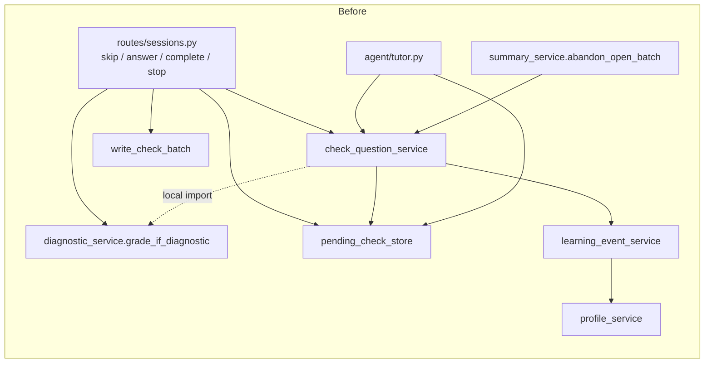
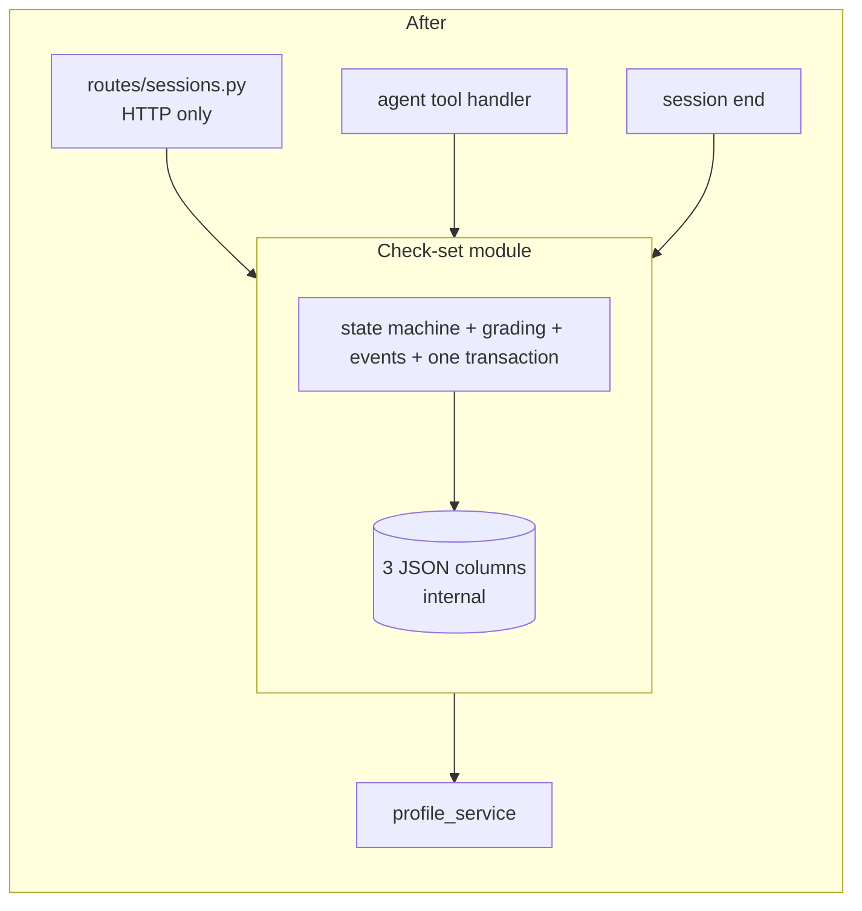
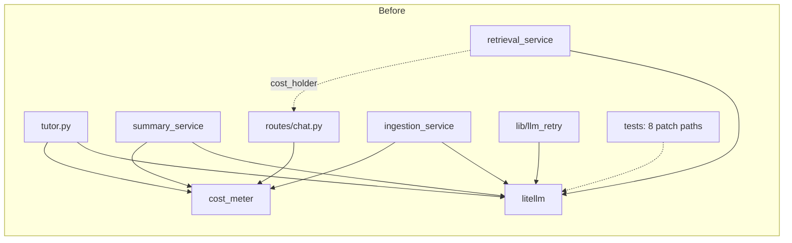
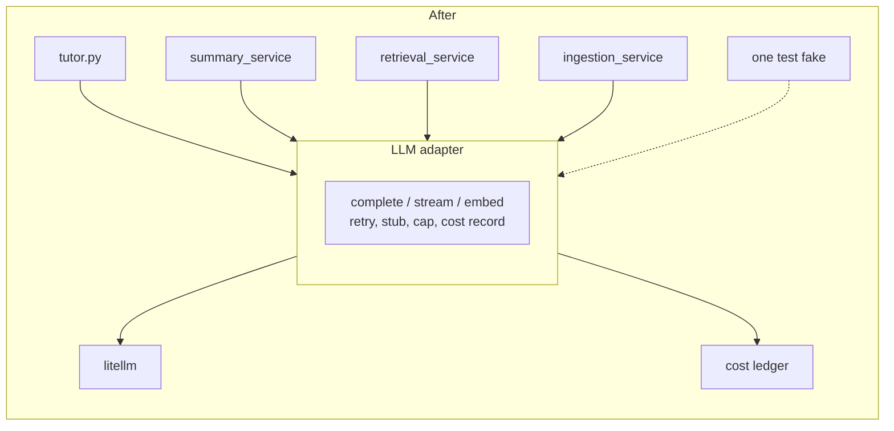
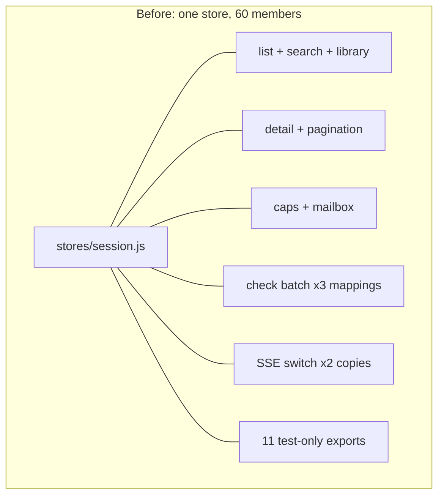
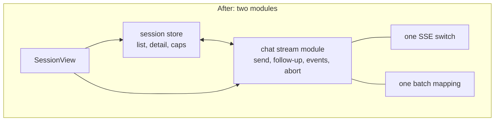

# Architecture review: deepening candidates (2026-09-26)

Survey of the whole codebase at `dev` 19c6dcd for **deepening opportunities**: refactors that turn shallow modules into deep ones. Vocabulary follows `/codebase-design`: a **module** is anything with an interface and an implementation; its **interface** is everything a caller must know; **depth** is behaviour per unit of interface; a **seam** is where an interface lives; an **adapter** fills a seam; depth buys **leverage** for callers and **locality** for maintainers. The **deletion test** asks whether deleting a module would concentrate complexity (it was earning its keep) or just move it (it was a pass-through).

This is a survey, not a design. No interfaces are proposed. Each candidate is a place to point `/grilling` next.

Method: four read-only sweeps (backend routes and services, agent subsystem, frontend views and stores, cross-cutting seams) weighted toward the files with the most churn over the last 300 commits: `SessionView.vue`, `Sidebar.vue`, `stores/session.js`, `routes/sessions.py`, `routes/chat.py`, `agent/prompts.py`, `check_question_service.py`. Line references are as of 19c6dcd. Claims that carry the top recommendation were re-read by hand; the rest are marked where they were not.

## Scale

| Area | Non-test source | Tests |
|---|---|---|
| Backend (Python) | ~12.7k lines | 117 files, ~1170 tests, ~24k lines |
| Frontend (Vue + JS) | ~21.2k lines (7.3k of it `<style>`) | 101 files, ~1470 tests, ~21.8k lines |

Tests already outweigh source. The friction is not missing tests. It is that the seams the tests cross are private helpers, module globals, and parent-held state, so each test patches many symbols to reach one behaviour.

## Constraints every slice must respect

These are recorded decisions and CI guards. A candidate that conflicts with one says so in its card.

- **Design spec wins.** `docs/superpowers/specs/2026-05-03-crux-v1-design.md` over all other docs.
- **Contracts are codegen.** Edit `docs/api/openapi.yaml`, run `python backend/scripts/gen_contracts.py`. CI enforces zero drift. Every route `raise` must be documented in the YAML.
- **G-13 wontfix (2026-09-21).** Splitting `run_streaming` in `agent/tutor.py` was declined: "revisit when a feature next touches `run_streaming`; do it then under that feature's tests." Candidate B3 reopens this; see its card.
- **G-14 import direction.** `services/profile_insights.py` imports `profile_service`, never the reverse. An AST test enforces it.
- **B-05 cost reservation.** The chat turn reserves cost before the LLM call and releases it on every exit path (normal, cancel, exception). Any change to the chat route or its stream pump must keep the release under the shield.
- **C-14 error contract.** Exact `ValueError` maps to 422; subclasses fall through to the coded 500. 409 stays route-owned.
- **F-18 ETag middleware.** Path-prefix allowlist, pure ASGI, fixed middleware order. The body `etag` on the profile (If-Match concurrency) is deliberately a separate mechanism.
- **#342/#356 prompt caching.** Learner preferences stay in the dynamic context so the `IMMUTABLE_RULES` prefix in `agent/prompts.py` stays byte-stable.
- **Alembic.** Any migration goes through `migration-reviewer` before commit.
- **Test safety net has a hole.** Backend tests run on in-memory SQLite. `with_for_update` is a no-op there, so the 17 `lock_session_row` sites and every transaction-boundary claim run unlocked in CI. Only `test_pgvector_retrieval.py` opts into Postgres. Candidates B1 and B4 move transaction boundaries; their characterisation tests need a Postgres run, not just SQLite.

---

## Backend candidates

### B1. Check-question lifecycle as one module

**Strength: Strong**

**Files:** `services/check_question_service.py` (632), `services/pending_check_store.py` (119), `services/diagnostic_service.py`, `services/learning_event_service.py`, `services/summary_service.py` (`abandon_open_batch`), `agent/tutor.py` (`attach_message_id` at 4 sites), `agent/tools.py`, `routes/sessions.py` 731-946 (skip, answer, complete, stop), `routes/chat.py` `_build_prompt_state` (reads `current_check` and cooldown).

**Problem.** A check set is one domain concept (the tutor asks, the server grades deterministically, learning events and the profile update, the recap renders) but its lifecycle is a spread of coordinated calls with no owner. The routes run the sequence: `answer_check` at `sessions.py:772-780` calls `answer()` (commits), then `write_check_batch` (commits), then `grade_if_diagnostic` (commits). Three transactions for one learner action, while the service docstring at `check_question_service.py:292` still says "ONE commit". `_complete_check_prepare` re-grades as a "crash-window backstop" (`sessions.py:823-829`) because no module owns the ordering. `grade_if_diagnostic` has 6 call sites, 3 in routes and 3 in the service. Transaction ownership is a parameter: a `commit=` flag appears on nine functions across four files. `pending_check_store.py` exists only to break an import cycle (its own docstring, lines 5-7), and callers reach the same function through two names (`check_question_service.get_pending_check` at `sessions.py:750`, `pending_check_store.get_pending_check` at `:818`). Seven `# local import avoids circular` sites sit in this cluster. `record_from_answer` takes 13 parameters including three behaviour flags, and its only production caller passes one fixed combination. State is three JSON blobs on the Session row plus `ChatMessage.check_batch_json`, shaped only by docstrings.

Understanding one check answer means reading 6 files and following 3 commits.

**Deletion test.** Delete `check_question_service`, `pending_check_store`, and `diagnostic_service` together and the complexity reappears in four route handlers and the agent loop. Concentrates. This cluster is earning its keep but its interface is spread across the callers.

**Solution.** Give the check lifecycle one module that owns the state machine (register, skip, answer, complete, stop, abandon), the grading, the learning-event write, and the transaction. Routes become HTTP translation only. The agent tool handler and the session-end path call the same module. The three JSON columns become an implementation detail behind it.

**Benefits.** Leverage: four routes, one tool handler and the end-session path share one implementation. Locality: the "ONE commit" invariant lives in one place and can be true; the crash-window backstop can be deleted or made deliberate. Tests: the 99 check tests move from route-level HTTP plus 9 patches of `run_streaming` (`test_check_complete_route.py`) to calling the module directly against a real DB, with the LLM out of the picture entirely because the model never grades.





**Watch.** SQLite tests do not exercise the row lock. A Postgres characterisation run of skip/answer/complete under concurrency is the gate.

### B2. Prompt state: one builder, not five

**Strength: Strong**

**Files:** `routes/chat.py:60-127` (`_build_prompt_state`), `routes/sessions.py:876-888` (`_followup_context`), `agent/prompts.py:495` (`build_system_prompt`), `scripts/eval_focus_clearing.py:178`, `scripts/eval_missed_concept_reference.py:124`, `scripts/eval_subtopic_levels.py:117`, `scripts/reliability_focus_clear.py:105`, `scripts/eval_diagnostic_consent.py:102`.

**Problem.** `build_system_prompt` is already a deep, pure renderer: 58 tests, zero patches. But its input is an untyped dict with about 15 keys, and that dict is hand-built in five places with different key sets. Verified by hand at 19c6dcd: the follow-up builder in `sessions.py` omits `learner_prefs`, `rolling_summary`, `current_check`, `gap_accuracy` and `diagnostic_required`. So every check follow-up turn renders default learner preferences, no rolling summary, and `DIAGNOSTIC` off, even though the same function sets `ctx.diagnostic_required` from the profile three lines later. The four eval scripts hand-build 6-key subsets and therefore evaluate a different prompt from production. One script imports the private `routes.chat._build_prompt_state` from a route module. `SEED_MODE` is rendered at `prompts.py:481` but every builder passes `None`. `agent/_stub.py:14` regex-parses the rendered `LAST_SESSION_SUMMARY:` line, coupling the stub to the prompt's text format.

**Deletion test.** Delete the five builders and the knowledge of "what does a turn's prompt need" reappears in each caller. Concentrates.

**Solution.** One module that, given a session and the turn kind (chat turn, check follow-up, eval), gathers everything the renderer needs and hands it over as one typed value. The five hand-built dicts become five calls. The renderer stays pure.

**Benefits.** Leverage: the eval scripts test the production prompt for free. Locality: adding a prompt input (as #342/#356 did for preferences) is one edit, not five, and the follow-up divergence is structurally impossible rather than a bug nobody tested. Tests: a single builder is testable against a seeded DB with no LLM; the existing 58 renderer tests are untouched.

**Constraint.** Learner preferences must stay in the dynamic context (#342/#356). The builder does not touch `IMMUTABLE_RULES`.

```
Before                                   After

chat.py ──── dict(15 keys) ──┐           chat.py ─────┐
sessions.py ─ dict(9 keys) ──┤           sessions.py ─┤
eval_a.py ─── dict(6 keys) ──┼─> render  eval_*.py ───┼─> [prompt-state module] ─> render
eval_b.py ─── dict(6 keys) ──┤           reliability ─┘        one typed value
eval_c.py ─── dict(7 keys) ──┘
   (5 shapes, 3 of them wrong)              (1 shape, tested once)
```

### B3. LLM call and metering as one adapter

**Strength: Strong**. Reopens G-13.

**Files:** `agent/tutor.py` (litellm at 6 sites; metering block 272-302 and `_record_partial_cost` 102-130), `services/summary_service.py` (6 litellm sites; metering block copied at 98-123 and 228-247), `services/cost_meter.py` (403), `services/retrieval_service.py` (embedding calls, `cost_holder` out-parameter at 174 and 223), `services/ingestion_service.py`, `lib/llm_retry.py`, `routes/chat.py:350-364` (rollback re-recording of `cost_holder`), `tests/conftest.py:166-178` (`mock_litellm`).

**Problem.** There is no LLM seam. Six production modules import `litellm` and call it directly. The sequence "completion_cost, fall back to token_counter, estimate cancelled cost, record_cost, log_call with extract_usage" is copy-pasted three times with a fourth variant for partial turns. About 47 metering call sites sit across 8 modules. The same cap is checked in four places. Retries exist for embeddings only, not for any completion. Three separate stub-mode checks. Metering leaks into retrieval's interface as a mutable list threaded through two functions and back to the route for rollback. Tests fake the LLM by patching 8 distinct module paths (`agent.tutor.litellm.acompletion` 22 times, `.completion_cost` 16, `services.summary_service.litellm.acompletion` 14, and so on), but those paths all resolve to the same global module, so the patches leak across modules. The `mock_litellm` fixture returns a non-streaming `.message.content` shape that `run_streaming` never reads (it iterates `.delta` at `tutor.py:241`); it only works for `summary_service` by accident of the global patch. Streaming fake helpers are duplicated across 7 test files.

**Two-adapter test.** This seam already has two adapters in practice: the real LiteLLM call and the `LLM_STUB` mode plus the test fakes. It is a real seam that has never been given a name.

**Deletion test.** Delete `cost_meter` and the metering reappears in five modules. Concentrates.

**Solution.** One module that owns "call the model and account for it": completion (streaming and not), embedding, retry, stub mode, and the cost record. Callers get back content plus a settled cost. `cost_holder` disappears from retrieval's interface. The test fake becomes one adapter at one seam, with the streaming shape right.

**Benefits.** Leverage: `tutor`, `summary_service`, `retrieval_service` and `ingestion_service` stop knowing about `completion_cost` and `token_counter`. Locality: the cap check and the cancelled-cost estimate live once. Tests: one fake replaces 8 patch targets and 7 copies of stream helpers; `test_tutor_stream.py` drops from 85 inline patches toward a handful.

**ADR conflict.** G-13 (2026-09-21) declined to extract seams from `run_streaming` because the payoff was readability only and the regression surface (streaming order, abort persistence, the cost double-count guard at `tutor.py:591-600`) was large. This candidate touches exactly that interleaved metering. It is worth reopening because the payoff is no longer readability: the follow-up SSE pump in `sessions.py` was copied without the shield, the test fixture is silently stale, and every new LLM-calling feature copies the block again. A codebase-wide refactor is the "feature that next touches it". The tests G-13 asked for are the characterisation tests this slice writes first.





### B4. Session guard sequence and ownership

**Strength: Worth exploring**

**Files:** `routes/sessions.py` (1002; 14 endpoints), `routes/chat.py:175-291` (`_prepare_turn_guards`), `routes/upload.py:115-324` (`upload_file`), `routes/profile.py:62-66` (`_owned_session_or_404`), `services/rate_limit.py`, `services/cost_meter.py`.

**Problem.** The rule "load the session, check it belongs to this user, 404 otherwise" is inlined 16 times (11 in `sessions.py`). The `session_ended` 409 is built 6 times, `duplicate_topic` 7 times, the DAILY_CAP 429 payload twice, the X-Cost-Warning header 5 times. The cost gate has two implementations of one policy (inline subquery in `chat.py:192-220`; `cost_meter.assert_within_caps` in `upload.py`). The "guard order is load-bearing" contract (cost cap, then 404/409, then `ensure_user`, then reserve, then rate limit) is restated in three routes with comments, and differs slightly each time: `create_session` calls `ensure_user` before its 404, `chat_stream` after. `rate_limit.check_and_increment` commits internally and `chat.py:244-289` depends on that commit by comment. The F-11 threadpool split left business logic in `_claim`/`_finish`/`_prepare` helpers cut along thread boundaries, not domain ones. Tests import 10 of these private helpers as their de facto interface. The SSE pump is duplicated between `chat.py:511-570` and `sessions.py:962-1002`; the copy has no `CancelScope(shield=True)` (verified). It takes no cost reservation either, so nothing needs releasing there today; the moment it does, the copy is the one that will be forgotten.

**Deletion test.** Delete the inline guards and each endpoint reinvents them. Concentrates, but the module is currently invisible: it is a convention, not code.

**Solution.** One module that answers "may this user take this action on this session right now", in one fixed order, returning the loaded row or the mapped error. Routes call it first and stop restating the order. The SSE pump becomes one function with the shield and release built in, used by both streaming endpoints.

**Benefits.** Leverage: 14 endpoints and 3 route modules share one guard. Locality: the ordering contract exists once and the three comment blocks go away; the commit-inside-rate-limit coupling can be resolved deliberately. Tests: guard tests run once against the module; endpoint tests stop importing private helpers.

**Watch.** Ordering changes here interact with B-05. The reservation must still be taken after the 404 and released on every exit. Postgres characterisation needed for the same SQLite reason as B1.

```
Before: each route restates the sequence      After: one guard module

sessions.py  [404][409][ensure][reserve][rate]   sessions.py ─┐
chat.py      [cap][404][ensure][reserve][rate]   chat.py ─────┼─> [guard(user, session, action)]
upload.py    [cap][404][rate]                    upload.py ───┘         one order, one 404, one 409
             (3 orders, 16 inline 404s)
```

### B5. Reference-file status and upload as one module

**Strength: Worth exploring**

**Files:** `routes/upload.py` (339; `upload_file` alone is 180 lines), `services/documents_service.py` (4 status helpers plus delete), `routes/chat.py:226-243` (its own count SQL feeding `status_from_counts`), `worker.py`, `services/ingestion_service.py`, `lib/keyword_index.py`, `services/retrieval_service.py` (`has_ready_document` at 3 sites), `routes/sessions.py:656` and `routes/upload.py:327` (two status endpoints), `frontend/src/composables/useReferencePoll.js`, `frontend/src/views/SessionView.vue:544` (restates the aggregate-status priority rule).

**Problem.** There is no upload module. The route does validation, SHA dedupe, cost gate, rate limit, chunk estimate, magic bytes, page count (duplicating ingestion's extractors at `upload.py:56-71`), row creation, the flush/commit protocol with the worker, and failure marking. Ingestion status is computed in four places: `documents_service.aggregate_status`, chat's inline SQL, and two GET endpoints. The frontend restates the priority rule once more. The chunk centroid is written by `retrieval_service` and nulled by two other modules. `uploadApi.getUploadStatus` has no production caller. A stale line-reference comment at `upload.py:180` points to a range in `chat.py` that has since moved.

**Deletion test.** Delete `documents_service` and status logic reappears in three routes and the frontend. Concentrates.

**Solution.** One module for a session's reference files: accept an upload, dedupe, enqueue, and answer "what is the status" from one place. Chat, the two GET endpoints, and retrieval's readiness check read that one answer.

**Benefits.** Leverage: one status computation serves four readers. Locality: the priority rule (ready / failed / pending) is in one place on the backend and reaches the frontend as data, not as a restated rule. Tests: upload tests stop needing HTTP plus five patches.

### B6. Learner profile access

**Strength: Worth exploring**

**Files:** `services/profile_service.py` (500), `services/profile_insights.py:30` (imports private `_parse_profile`), `services/session_enrichment.py:~99` (raw `json.loads(topic_profile_json)`), `services/export_service.py`, `services/diagnostic_service.py`, `services/learning_event_service.py`, `services/summary_service.py`, `services/topic_suggest_service.py`, `routes/sessions.py` (6 profile calls), `routes/profile.py`, `routes/review.py`, `routes/chat.py`.

**Problem.** The learner profile is a JSON blob on the Session row with a tolerant parser that upgrades legacy shapes. Most readers go through `profile_service`, but `session_enrichment` does a raw `json.loads`, bypassing the upgrade, and `profile_insights` imports the private parser. There are two patch paths (`apply_user_patch` at 251, `apply_patch` at 330). `lock_session_row` has 17 call sites in 8 files, so the locking discipline is a convention each caller re-learns. `seed_from_prior` at 207 has zero production callers (verified); `_create_session_finish` at `sessions.py:222-225` duplicates it inline. `load_profile` is a one-line pass-through. `last_session_summary` lives inside the profile blob while `rolling_summary` is a separate column; `_build_end_summary` in the route strips the `[auto] ` prefix that `summary_service._mechanical_fallback` adds.

**Deletion test.** Delete `profile_service` and the parser reappears in nine modules. Concentrates.

**Solution.** Close the seam: the profile module is the only reader and writer of the blob, the lock is taken inside it, and the two patch paths become one. Session summary ownership is decided (in the blob or in the column, not both).

**Benefits.** Locality: a schema change to the profile touches one module. The G-14 import direction is preserved (insights still import profile, never the reverse) and no longer needs the private-name import. Tests: 115 profile tests already exist and mostly test the service directly; this mostly removes bypasses rather than adding coverage.

### B7. Contract mapping

**Strength: Speculative**

**Files:** `backend/contracts/models.py` (967, codegen), `routes/sessions.py` (22 contract constructions; `_to_response` at 72 runs two extra queries), `routes/me.py:24` (`_to_response`), `services/profile_service.py` (15 constructions), `services/export_service.py` (8), and 16 other modules.

**Problem.** Contract objects are built by hand with keyword arguments at about 110 sites across 20 modules. Two private `_to_response` functions exist with the same name. Services return mixed shapes (ORM rows from `documents_service`, contract models from `profile_service`). SSE events have no contract at all: the vocabulary is a comment at `agent/stream_events.py:14` and payloads are free-form dicts. The frontend has no typed mirror and reads snake_case fields ad hoc (`ended_at` at 30 sites in 10 files). Hand-kept mirrors of backend values are maintained by comment: `lib/errorCodes.js`, `legal/version.js`, `uploadApi.js:17` (`MAX_UPLOAD_BYTES`).

**Why speculative.** The codegen seam already exists and CI guards it. Adding a mapper layer for 63 contract classes would be a lot of interface for little behaviour, which is the shallow shape this review is trying to remove. The real friction is narrower: the two `_to_response` functions, the SSE vocabulary, and the three hand-kept mirrors. Those could be picked off inside B4 (session response) and F2 (stream events) rather than as their own slice.

---

## Frontend candidates

### F1. One HTTP transport

**Strength: Strong**

**Files:** `services/apiClient.js` (358; `request` at 223-330), `services/chatStreamService.js:22-78` (`_fetchSse`), `services/uploadApi.js:45-97`, `stores/auth.js`, `main.js:25`. `VITE_API_BASE_URL` default duplicated at `apiClient.js:7`, `chatStreamService.js:10`, `uploadApi.js:11`.

**Problem.** Three raw-`fetch` writers each re-implement Bearer header building, the 401 refresh-and-retry-once, `_onAuthExpired`, and GET-cache invalidation, importing the underscore-prefixed "private" helpers from `apiClient` to do it. The SSE and upload paths construct `ApiError` themselves and skip `reportApiError`, so the toast path is inconsistent. The `silent: true` decision is scattered: baked into some `sessionsApi` calls, passed by callers on others (25 sites). Token and refresh knowledge lives in four modules plus the auth store.

**Two-adapter test.** JSON request, SSE stream, and multipart upload are three real transports over one auth and error policy. The seam is real; the policy is what should be shared.

**Deletion test.** Delete `apiClient` and the refresh logic reappears in the two other writers. Concentrates.

**Solution.** One module owns "send an authenticated request and handle auth expiry and error reporting", with JSON, stream and upload as three thin adapters on top. The base URL, the 60-second expiry margin, the refresh, and the cache invalidation exist once.

**Benefits.** Leverage: three transports, one policy. Locality: an auth change (for example when a revocation primitive lands; A-01 notes there is none today) is one edit. Security-adjacent code stops being copied. Tests: the 10 test files that stub global `fetch` and the 1 that mocks `apiClient` collapse to faking one seam.

```
Before                                        After

apiClient.request ── token, refresh, 401 ──┐   ┌── json adapter ───┐
chatStreamService ── token, refresh, 401 ──┼─> │   sse adapter ────┼─> [transport: auth + retry + errors + cache] ─> fetch
uploadApi ────────── token, refresh, 401 ──┘   └── upload adapter ─┘
   (3 copies of the auth policy)                  (1 policy, 3 thin adapters)
```

### F2. Chat stream as a module carved out of the session store

**Strength: Strong**

**Files:** `stores/session.js` (1128; `sendMessageStreaming` 919-1042, `_runCheckFollowup` 666-771, SSE `onEvent` switch at 694-741 and again at 950-987, check-batch mapping at 17-45, 273-293 and 565-583), `services/chatStreamService.js`, `views/SessionView.vue` (34 store members used, 16 stale-id guards).

**Problem.** The session store returns 60 members and covers the sidebar list and search, the library, the session detail, message pagination, cost caps, the end/reopen mailbox, the check-batch state machine, and SSE streaming. Eleven of those members are exported only so tests can reach stream internals (`appendAssistantDelta`, `recordToolCall`, `setCitations`, `finalizeMessage`, `handleAbortError`, `handleCheckQuestion`, `abortController`, and four more). The SSE event switch is copy-pasted between the chat turn and the check follow-up. Check-batch item mapping is written three times. One shared `loading`/`error` pair serves six unrelated actions. `reset()` skips four fields. `stores/user.js:59` reaches across to call `useSessionStore().reset()`. `SessionView.vue` compensates: `store.streamState !== 'idle'` is recomputed inline four times; profile state is split so the view keeps a fresher `diagProfile` and merges it in `liveProfile`.

**Deletion test.** Delete the streaming half of the store and the event switch reappears in the view. Concentrates. Delete the eleven test-only exports and nothing in production changes: those are interface with no leverage.

**Solution.** The chat stream (send, follow-up, event handling, abort, message append with retention) becomes its own module with a small interface; the store keeps sessions, list, and detail. The event switch exists once. The check-batch mapping exists once. The test-only exports become internal seams used by that module's own tests.

**Benefits.** Leverage: `SessionView` and any future surface drive the stream through a handful of members. Locality: an SSE vocabulary change (see B7 on the missing event contract) is one edit. Tests: `sessionStore.test.js` (1560 lines) and `sessionCheckFlow.test.js` split along the new seam; the 76 direct `store.x =` fixture writes in `sessionView.test.js` shrink because the view holds less.





### F3. Async page and list composable

**Strength: Strong**. Freshest churn: #385 (Recall load more) and the Sessions library.

**Files:** `views/RecallView.vue:127-190`, `views/SessionsLibraryView.vue:35-200`, `views/ProfileView.vue:327-385`, `views/AggregateProfileView.vue:326-330`, `components/settings/UsageTab.vue:23-27`, `components/sidebar/Sidebar.vue:137-184` (search), `composables/useReferencePoll.js`, `composables/useStartFlow.js`.

**Problem.** Fetch plus loading plus error plus retry is hand-rolled in five views with three different error types (`false`, `null`, `''`). Pagination is implemented two different ways: `RecallView` with `nextOffset` and a button, `SessionsLibraryView` with `offset`, `_loadSeq` and an `IntersectionObserver`. Stale-response guards appear at 43 sites in 7 files under three naming schemes (`seq`, `gen`, `id`). Sidebar search calls `sessionsApi` directly but writes results into `store.searchRows` while keeping `searchTotal` and `searchLoading` local, so ownership is split across two modules. `SIDEBAR_CAP_MAX = 40` mirrors the store's `SIDEBAR_PAGE_LIMIT = 40` by comment only.

**Deletion test.** Delete any one view's loader and the same shape is rebuilt from the neighbour. Concentrates, and the concentration point does not exist yet.

**Solution.** One composable that owns "load a page, know if it is stale, expose loading and error and retry, and load more". Views describe what to fetch; the composable handles the lifecycle. The two pagination styles become one with a rendering choice.

**Benefits.** Leverage: five views and the sidebar search share one implementation; the next list page (Recall already got one this week) is a few lines. Locality: the stale-guard idiom exists once; the #385 dedup edge case is fixed once. Tests: the dedup and empty-page tests written for #385 become the composable's tests and cover every list.

```
Before: 5 views x (loading, error, retry, seq guard, offset)   After: 1 composable

RecallView        loading error moreLoading moreError nextOffset   RecallView ─────┐
SessionsLibrary   loading error _loadSeq offset total IO           SessionsLibrary ┤
ProfileView       loading error _applyWrite                        ProfileView ────┼─> [async page module]
AggregateProfile  loading error                                    AggregateProf ──┤     loading, error, retry,
Sidebar search    searchLoading searchTotal seq                    Sidebar search ─┘     stale guard, load more
```

### F4. Session page held together by one view

**Strength: Worth exploring**. Depends on F2 and F3 landing first.

**Files:** `views/SessionView.vue` (1538: template 1-241, script 243-1200, style 1202-1538), `components/chat/CueColumn.vue` (762), `components/chat/SessionHeader.vue` (516), `components/chat/CheckQuestion.vue`, `components/chat/Composer.vue`, `composables/useSessionActions.js`.

**Problem.** The view is almost entirely orchestration. Distinct concerns with their own line ranges: session load and switch (~120 lines, with the `current` target-id discriminator), optimistic header assembly (~40), send and retry and draft stash, the stream-edge watcher, the diagnostic consent card (~150 lines including its own ETag PATCH, 412 refetch and retry, five stale-id guards), the topic suggest card (duplicating `send()`'s error shape), cap toasts, whole-page scroll and autoscroll (~130 lines of window listeners and `let` flags), upload and reference poll with its own `uploadGen` on top of `useReferencePoll`'s generation counter, resume and review-gap and quiz seeds, four identical check handlers, and the end-summary dialog. It wires 34 store members, 20 refs, 21 computeds, 10 watchers, 7 module-level `let` flags and 37 functions, and imports `profileApi`, `uploadApi` and `costBus` directly. It holds `cuesLanded` only to pass CueColumn's output back into MessageList. The test file is 2289 lines with 107 tests, 128 `vi.spyOn(store, ...)` calls, and one top-level describe running 1100 lines; consent, load-earlier, scroll and upload are only testable by mounting the whole view.

**Deletion test.** Delete the view and every concern lands in a child. Concentrates, but the concentration is in the wrong place: a page should compose modules, not be the module.

**Solution.** Each named concern becomes its own composable with a small interface (consent flow, scroll follow, seeds from query params, upload with poll). The view composes them. This is the same move the 2026-09-23 shell redesign already made for rename/pin/end with `useSessionActions`.

**Benefits.** Locality: the diagnostic consent flow, which is a product rule with its own ETag protocol, becomes readable and testable in isolation. Tests: `sessionView.test.js` splits into per-composable tests without mounting 14 children.

**Why not first.** Without F2 the view still owns stream state; without F3 the consent and upload flows have no shared loader to lean on. Do this after both.

### F5. If-Match write flow

**Strength: Worth exploring**. Small, could fold into F3 or F4.

**Files:** `views/SessionView.vue:940-992` (consent PATCH), `views/ProfileView.vue:337-422` (`_applyWrite`), `services/profileApi.js`.

**Problem.** Two views implement the profile's If-Match concurrency protocol differently. `SessionView` refetches and retries once on 412. `ProfileView` serialises writes, shows a conflict, and reloads. The backend intentionally keeps this body `etag` separate from the HTTP ETag middleware (2026-09-21), so the frontend is the only place the protocol is spelled out, and it is spelled out twice.

**Solution.** One composable for "write with If-Match, recover on 412" with a policy choice (retry once or surface conflict). Both views use it.

### F6. Card as a CSS object

**Strength: Worth exploring**. The one candidate where `CONTEXT.md` vocabulary applies directly.

**Files:** 22 `.vue` files carry `box-shadow: 0 1px 0 var(--card-drop)`; `var(--card-edge)` appears on 47 lines in 33 files; `assets/base.css` (594), `assets/sheet.css` (83), `assets/profile.css` (158), `assets/dialogs.css` (189); `DESIGN.md:255, 262, 307`.

**Problem.** `CONTEXT.md` defines **Card** as "the base unit of the world" and lists ten things built from it. `DESIGN.md` describes one card object. There is no shared card class. Each component re-declares the stock, the 1px `card-edge`, the 6px radius and the 1px hard drop. `<style>` is 7305 lines, 44% of all `.vue` source. `sheet.css` and `profile.css` are partial card systems scoped to two routes each. Related idioms repeat at similar scale: `:focus-visible` 71 rules in 33 files, the text-underline-offset link idiom 42 in 27 files, `prefers-reduced-motion` in 17 files, `.error` defined in 7 files.

**Deletion test.** Delete one component's card rules and they are copied back from the neighbour. Concentrates, at the class that does not yet exist.

**Solution.** One card object (and its stock variants) in shared CSS, matching the `CONTEXT.md` definition, with the focus and link idioms alongside it. Components stop re-declaring it.

**Benefits.** Locality: the 2026-09-23 shell redesign touched card rules in many files; the next visual pass touches one. `DESIGN.md` and the code say the same thing. The scoped-CSS root-leak gotcha (a parent scoped rule leaking onto a child root) has fewer places to bite.

**Constraint.** `DESIGN.md` is the visual source; this candidate implements it, it does not reinterpret it. Verify in the real app, not only in tests, per the root-leak gotcha.

---

## Not proposed

- **A repository layer over SQLAlchemy.** Services already accept `db: Session`; only three places open their own. Raw SQL is three `text()` calls. Nothing varies across a hypothetical repository seam, so it would be one adapter with a large interface: the shallow shape. `pgvector_store` and `object_store.get_store()` are the real store seams and already exist.
- **Async-everywhere.** 60 sync routes and 9 async with threadpool hops is the deliberate F-11 choice (recorded only in route docstrings, `routes/chat.py:183,297,345`, not in `docs/decisions.md`). Not friction this review found.
- **Splitting `routes/sessions.py` by file.** Moving 14 endpoints into three files changes nothing about depth. B1, B4 and B5 remove the logic that makes it 1002 lines; the file gets short as a side effect.

## Defects found in passing

Not architecture, but found while surveying. Each is a candidate GitHub Issue. None were fixed in this review.

1. **Check follow-up turns render a degraded prompt.** `routes/sessions.py:876-888` omits `learner_prefs`, `rolling_summary`, `current_check`, `gap_accuracy` and `diagnostic_required`; follow-ups run with default preferences, no rolling summary, and `DIAGNOSTIC` off. Verified at 19c6dcd. Fixed structurally by B2; fixable today in one edit.
2. **Follow-up SSE pump has no shield.** `routes/sessions.py:962-1002` copies the chat pump without `CancelScope(shield=True)`. Absence verified. Whether a disconnect can cut `_persist_assistant_message` mid-write on this path is untested; the chat pump's comment block says that is exactly what the shield prevents there.
3. **`mock_litellm` fixture is stale for the tutor.** `tests/conftest.py:166-178` returns a non-streaming shape; `run_streaming` iterates `.delta` (`tutor.py:241`). It only works for `summary_service`. The `test_tutor_stream.py` docstring references `run()`, which no longer exists. Verified.
4. **`profile_service.seed_from_prior` is dead code**; `_create_session_finish` duplicates it inline. Verified.
5. **`SEED_MODE` is rendered but always `None`** (`prompts.py:481`; every builder). Reported, not re-read.
6. **`stores/session.js` `reset()` skips `loading`, `detailLoading`, `checkAnswering`, `checkCompleting`.** Reported, not re-read.
7. **Stale cross-file line reference** at `upload.py:180` pointing to `chat.py:141-153`, now `_cost_cap_error`. Other coupling-by-comment at `sessions.py:788`, `upload.py:150`, `retrieval_service.py:228`, `summary_service.py:54-55`. Reported.
8. **`uploadApi.getUploadStatus` has no production caller** (tests only). Reported.
9. **`session_enrichment` parses the profile blob with raw `json.loads`**, bypassing the legacy-shape upgrade. Reported.
10. **`AggregateProfileView:382` uses `toLocaleDateString`** instead of `utils/formatDate.js`. Reported.

## Ranking

| # | Candidate | Strength | Payoff | Risk | Depends on |
|---|---|---|---|---|---|
| B2 | Prompt state builder | Strong | Fixes a live divergence; evals match production | Low: pure renderer already tested | none |
| F1 | One HTTP transport | Strong | Auth policy exists once; security-adjacent | Low: three call paths, all under test | none |
| F3 | Async page composable | Strong | Freshest churn; next list is cheap | Low | none |
| B3 | LLM + metering adapter | Strong | 47 sites, 8 patch paths, stale fixture | Medium: reopens G-13; streaming order | none, but B2 first makes tutor tests cleaner |
| F2 | Chat stream module | Strong | Store shrinks; event switch once | Medium: 1560-line store test to split | F1 |
| B1 | Check-set module | Strong | 6 files to 1; one transaction | Medium-high: needs Postgres characterisation | B2 (shares prompt state for follow-ups) |
| B4 | Session guard sequence | Worth exploring | 16 inline 404s, 3 orderings | Medium: B-05 ordering | B3 (reserve moves into adapter) |
| B5 | Reference-file module | Worth exploring | Status computed once | Low-medium | none |
| B6 | Profile access | Worth exploring | Close bypasses | Low | none |
| F4 | Session page composition | Worth exploring | 1538-line view becomes composition | Medium | F2, F3 |
| F6 | Card CSS object | Worth exploring | 22 copies to 1; matches CONTEXT.md | Low, verify visually | none |
| F5 | If-Match write flow | Worth exploring | Two protocols to one | Low | fold into F3/F4 |
| B7 | Contract mapping | Speculative | Narrow real friction | Would add shallow interface | pick off inside B4/F2 |

## Top recommendation

**Start with B2, the prompt state builder.** It is the smallest slice with the largest verified payoff: it removes a live behaviour divergence (check follow-ups run a degraded prompt), makes the eval scripts test the production prompt, and lands on top of a renderer that already has 58 pure tests. It has no dependencies and touches no transaction boundary, so the SQLite safety-net hole does not apply. It also clears the ground for B1 (the check-set module needs a follow-up prompt) and B3 (tutor tests get simpler once the prompt input is one value).

**Then run F1 and F3 in parallel on the frontend.** Both are independent, low risk, and one of them (F3) sits on the freshest churn in the repo. F1 is where the auth policy is copied three times; that should stop before any auth change lands.

**Then B3, reopening G-13 on purpose.** The characterisation tests G-13 asked for are the first ticket of that slice. Write them against Postgres for the abort and reserve paths.

B1, F2 and B4 follow once those seams exist. F4 and F6 are worth doing but are payoffs, not prerequisites.

Each slice should be its own tracer-bullet ticket that merges to `dev` independently. Big-bang refactor branches rot against `dev` in days here; the commit history shows `dev` moving several times a day.
