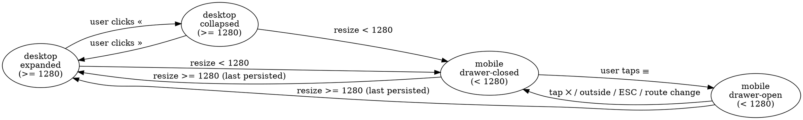

# AdaptLearn Sidebar Refactor Spec — 2026-05-28

**Companion to:** [`docs/ui-audit.md`](ui-audit.md), [`docs/ui-remediation-spec.md`](ui-remediation-spec.md).
**Branch:** `ui-audit/2026-05-28` (off `dev`), or split to `feat/sidebar-shell` if remediation spec ships first.
**Scope.** Replace global sticky-pill topbar with a persistent left sidebar shell (claude.ai pattern). Rehome all current topbar controls into the sidebar. Add a minimal chat-local header above messages for in-session topic display. Mobile becomes overlay drawer. Simplify HomeView to a welcome page (tile grid moves to sidebar).

## Decisions locked

| # | Question | Decision |
|---|---|---|
| 1 | HomeView fate | **Simplify** — drop tile grid + tabs, keep welcome / empty state + duplicate banner. Sidebar owns the session list. |
| 2 | `ChatHeader.vue` | **Delete** — replaced by new `SessionHeader.vue`. Clean break, no lingering removed-feature code. |
| 3 | Mobile top strip | **Always visible** on `<1280px` viewports across every route. Consistent drawer-open affordance. |
| 4 | Keyboard shortcut | **No shortcut for v1.** Click-only. Re-evaluate after launch. |
| 5 | Sidebar default | **Expanded on first visit**, persisted in localStorage. Auto-collapses below `1280px` breakpoint. |
| 6 | Session list grouping | **Two sections** — Active above Ended. Ended collapsible. |
| 7 | In-session header | **Both** — minimal chat-local header (topic + Back) + sidebar row context menu (End session lives here). |
| 8 | Auth routes (`/login`, `/onboarding`) | **Hide sidebar on both.** Route meta `meta.sidebar: false`. App.vue renders only `<RouterView />` (no shell) when meta flag set. |
| 9 | Resume from ended row | **Re-open in place** via existing `store.reopenSession(id)`. Row moves from Ended → Active section. No backend change. |
| 10 | Loading state | **Three muted skeleton rows** while `store.listSessions()` is in flight. Pulsing placeholder; matches claude.ai pattern. |
| 11 | Empty session list | **Muted hint line** under section labels: `"No sessions yet. Click + New session above."` Section headings still render so users understand the structure. |
| 12 | Mobile stacking on `/session/:id` | **Two sticky rows.** Top strip (hamburger + brand + globals) above SessionHeader (topic). Total ~6rem sticky height. Topic always visible while scrolling. |
| 13 | Row context menu items | **End / Resume only.** Active row → End session. Ended row → Resume. No Open-profile, no Rename for v1. |
| 14 | BackButton in SessionHeader | **Dropped.** Sidebar row click is the navigation primitive. SessionHeader renders just `<h1>{{ topic }}</h1>`. Browser back still works natively. |
| 15 | Sidebar surface color | **Same as `--color-background`.** No new tokens. Sidebar is visually contiguous with the page; the only separator is a 1px `--color-border` right edge. |

`★ Insight ─────────────────────────────────────`
- The current shell uses Vue Teleport to inject `ChatHeader` into a `#session-nav-slot` inside the topbar. The refactor removes the slot — chat-local header becomes a normal inline element. This eliminates the cross-tree coupling that made the slim header brittle on route changes.
- Two viewport breakpoints (`>=1280px` desktop / `<1280px` mobile) keep the state machine simple: 2 desktop states (expanded / collapsed) + 2 mobile states (drawer-closed / drawer-open). Auto-collapse on resize, persist desktop choice in localStorage.
- "End session" + flag confirmation flow stays — it just moves from a top-bar pill to a row context-menu on the active session in the sidebar. No backend or store changes.
`─────────────────────────────────────────────────`

---

## Goals

1. Persistent session list visible without leaving chat. One-click pivot between sessions.
2. Chat surface gets full horizontal real estate when collapsed.
3. Match claude.ai mental model — users transferring from other chat apps land in familiar territory.
4. Lay groundwork for future features: session search, pinning, folder groupings (out of scope here, but layout must accommodate without redesign).

## Non-Goals

- Search / filter / pin / archive functionality (Phase 9+).
- Drag-to-resize sidebar width.
- Folder or tag groupings inside the sidebar.
- Three-state theme cycle (still out of scope per B9 of remediation spec).
- Backend changes. Aggregate profile + session APIs unchanged.

---

## Final layout

### Desktop expanded (≥ 1280px, sidebar 16rem)

```
┌────────────────┬──────────────────────────────────────────────────┐
│ ✦ AdaptLearn  «│ ← Back   Big-O notation                          │  ← session-header
│                │                                                  │     (chat-local)
│ + New session  │                                                  │
│                │  (assistant bubble…)                             │
│ ACTIVE  (2)    │                                                  │
│ ● Big-O · 2d  …│  (you bubble…)                                   │
│ ○ Trees · 4h  …│                                                  │
│                │                                                  │
│ ENDED  (1)  ▾  │                                                  │
│ ○ Recursion   …│                                                  │
│                │                                                  │
│ ──────────────│                                                  │
│ 👤  ☀/🌙  ⚙  ⎋ │  (composer + hints)                              │
└────────────────┴──────────────────────────────────────────────────┘
```

- `«` = collapse toggle (chevron)
- `●` = current session marker (coral dot)
- `…` = per-row context menu trigger (hover/focus reveal)
- Bottom rail: profile, theme toggle, settings, sign-out — globals only

### Desktop collapsed (≥ 1280px, sidebar 3rem icon rail)

```
┌──┬────────────────────────────────────────────────────────────────┐
│ ✦│ ← Back   Big-O notation                                        │
│ »│                                                                │
│ +│  (assistant bubble…)                                           │
│ ●│                                                                │
│ ○│  (you bubble…)                                                 │
│ ○│                                                                │
│  │                                                                │
│ ─│                                                                │
│ 👤│                                                               │
│ ☀│                                                                │
│ ⚙│  (composer + hints)                                            │
│ ⎋│                                                                │
└──┴────────────────────────────────────────────────────────────────┘
```

- Hover any session row → tooltip with full topic + last-active relative time
- Active row marked with coral left-edge bar + dot
- `»` = expand toggle

### Mobile drawer closed (< 1280px)

```
┌──────────────────────────────────────────────────────────────────┐
│ ☰  ✦ AdaptLearn                                       👤 ☀  ⎋   │  thin sticky strip (sticky #1)
├──────────────────────────────────────────────────────────────────┤
│ Big-O notation                                                   │  session-header (sticky #2)
│                                                                  │
│  (assistant bubble…)                                             │
│  (you bubble…)                                                   │
│                                                                  │
│  (composer + hints)                                              │
└──────────────────────────────────────────────────────────────────┘
```

- Top strip is mobile-only. Hamburger opens drawer. Bottom-rail icons (profile, theme, sign-out) move into the strip's right side. Settings goes inside the drawer footer to keep the strip thin.
- Two stacked sticky rows on `/session/:id`: top strip (~3rem) at `top: 0`, then SessionHeader (~3rem) at `top: var(--sidebar-mobile-strip-height)`. Total ~6rem of sticky chrome above messages. Topic stays visible while scrolling.
- On non-session routes (Home, Profile, Aggregate, Settings) only the top strip is sticky; no SessionHeader renders.

### Mobile drawer open (< 1280px)

```
┌────────────────┬─────────────────────────────────────────────────┐
│ ✦ AdaptLearn ✕│ ░░░░░░░░░░░░░░░░░░░░░░░░░░░░░░░░░░░░░░░░░░░░░░░ │
│                │ ░░ backdrop dims main, click outside closes ░░░ │
│ + New session  │ ░░░░░░░░░░░░░░░░░░░░░░░░░░░░░░░░░░░░░░░░░░░░░░ │
│                │ ░░░░░░░░░░░░░░░░░░░░░░░░░░░░░░░░░░░░░░░░░░░░░░ │
│ ACTIVE  (2)    │ ░░░░░░░░░░░░░░░░░░░░░░░░░░░░░░░░░░░░░░░░░░░░░░ │
│ ● Big-O · 2d  …│ ░░░░░░░░░░░░░░░░░░░░░░░░░░░░░░░░░░░░░░░░░░░░░░ │
│ ○ Trees · 4h  …│ ░░░░░░░░░░░░░░░░░░░░░░░░░░░░░░░░░░░░░░░░░░░░░░ │
│                │ ░░░░░░░░░░░░░░░░░░░░░░░░░░░░░░░░░░░░░░░░░░░░░░ │
│ ENDED  (1)  ▾  │ ░░░░░░░░░░░░░░░░░░░░░░░░░░░░░░░░░░░░░░░░░░░░░░ │
│                │ ░░░░░░░░░░░░░░░░░░░░░░░░░░░░░░░░░░░░░░░░░░░░░░ │
│ 👤  ☀  ⚙  ⎋   │ ░░░░░░░░░░░░░░░░░░░░░░░░░░░░░░░░░░░░░░░░░░░░░░ │
└────────────────┴─────────────────────────────────────────────────┘
```

- Drawer width 16rem max. Slides from left, `transform: translateX()`. Backdrop `rgba(0,0,0,0.5)`. Body scroll locked while open. ESC + outside click + X icon all close.
- Focus trapped within drawer when open (a11y).

---

## Sidebar structure

### Header (top, fixed)

| Slot | Content | Notes |
|---|---|---|
| Brand | `<Logo size="md" variant="full" />` in expanded; mark only in collapsed | Click = navigate to `/` |
| Collapse toggle | Chevron icon button | Desktop only. Toggles expanded ↔ collapsed. Hidden on mobile (drawer has its own close X). |
| Close (mobile drawer) | `×` icon button | Mobile only. Hidden on desktop. |

### New session CTA (below header)

- Full-width pill button in expanded state, icon-only square in collapsed state
- Style mirrors current `.cta-primary` on `HomeView` — coral fill, white text, `--shadow-pop`
- Click → `router.push({ name: 'new-session' })`
- Tooltip in collapsed mode: "New session"

### Session list (scrollable middle, flex: 1)

Two sections:

**Active** — always expanded
```
<section.sb-sessions-active>
  <h3.sb-section-label>Active (2)</h3>
  <ul.sb-session-list v-if="!loading && activeSessions.length">
    <SidebarSessionRow v-for="s in activeSessions" :session="s" />
  </ul>
  <SidebarSkeletonList v-else-if="loading" :count="3" />
  <p v-else class="sb-empty-hint">No sessions yet. Click + New session above.</p>
</section>
```

**Ended** — collapsible (default collapsed if > 5 ended; default open if ≤ 5)
```
<section.sb-sessions-ended v-if="endedSessions.length || loading">
  <button.sb-section-toggle :aria-expanded="endedOpen">
    Ended (n) <chevron />
  </button>
  <ul v-show="endedOpen" .sb-session-list>
    <SidebarSessionRow v-for="s in endedSessions" :session="s" muted />
  </ul>
</section>
```

Section labels use existing `.label` class (`--fs-label`, uppercase, `--tracking-label`, `--color-text-muted`).

### Loading state: `SidebarSkeletonList.vue`

Renders `props.count` skeleton rows. Each row is the same height as a real `SidebarSessionRow` (~3rem with meta line). Pulse animation via `@keyframes sb-skel-pulse` on background opacity, 1.4s ease-in-out infinite. Respects `prefers-reduced-motion` (animation duration falls to 0.01ms via the global guard from remediation C5).

```vue
<template>
  <ul class="sb-skel-list" aria-hidden="true">
    <li v-for="i in count" :key="i" class="sb-skel-row">
      <span class="sb-skel-dot" />
      <span class="sb-skel-lines">
        <span class="sb-skel-line sb-skel-topic" />
        <span class="sb-skel-line sb-skel-meta" />
      </span>
    </li>
  </ul>
</template>
```

Backgrounds use `var(--color-surface-soft)`. `aria-hidden="true"` because screen readers should hear nothing during loading — the section count `(n)` and the row data take over once loaded.

### Empty hint state

A single muted line under the Active section label when the user has zero sessions:

```css
.sb-empty-hint {
  font-family: var(--font-sans);
  font-size: var(--fs-caption);
  color: var(--color-text-muted);
  padding: 0.5rem 0.75rem;
  margin: 0;
  line-height: 1.4;
}
```

Ended section is omitted entirely (`v-if="endedSessions.length || loading"`) when there are no ended sessions. The Active section heading + the hint line are enough to communicate "this is where sessions will live".

### Session row (`SidebarSessionRow.vue`)

```
┌──────────────────────────────────────────┐
│ ● Big-O notation                  …      │  expanded
│   started 2 days ago                     │
└──────────────────────────────────────────┘

┌────┐
│ ●  │  collapsed (tooltip: "Big-O notation · 2d")
└────┘
```

- Click row → `router.push({ name: 'session', params: { id: s.id } })`
- Marker dot: `●` filled coral if current route's session id matches, `○` outlined otherwise
- Topic truncates with `text-overflow: ellipsis`, `white-space: nowrap`
- Meta line: `formatRelative(created_at || ended_at)` — only shown in expanded state
- `aria-current="page"` on the current session row
- Auto-scroll the active row into view when route changes

Row context menu (`…` button revealed on hover/focus on desktop; always visible on mobile since no hover):
- Opens popover anchored to the button
- Menu items (v1):
  - **Active row**: `End session` → triggers existing end-session confirm modal (same as old ChatHeader). Works regardless of whether the row is the current route or not.
  - **Ended row**: `Resume` → calls `store.reopenSession(id)` then `router.push({ name: 'session', params: { id } })`. Row moves from Ended to Active.
- No Open-profile, no Rename items in v1.
- Use plain `<button>` + popover divs (no PrimeVue Menu — project barely uses PrimeVue). Backdrop click closes; ESC closes.

### Bottom rail (footer, fixed)

| Position | Icon / Control | Behavior |
|---|---|---|
| 1 | `<RouterLink to="/profile">` profile icon | Same as current topnav profile link |
| 2 | Theme toggle (sun/moon pill — keep existing `useTheme` machine) | Same toggle behavior |
| 3 | `<RouterLink to="/settings">` settings cog | Same as current |
| 4 | Sign-out button (visible only if `isAuthenticated`) | Same `onSignOut()` flow |

Layout:
- Expanded: row of 4 icons, gap `0.5rem`, centered horizontally, with a 1px `--color-border` hairline above
- Collapsed: vertical stack of 4 icons
- Mobile drawer: same as expanded
- All icons get `:title` (carries over from C1 remediation spec)

---

## Main column (`.main-col`)

### Chat-local session header (`.session-header`)

Replaces the current teleported `ChatHeader.vue`. Renders inline above the messages, **only on session routes**.

```vue
<!-- New: components/chat/SessionHeader.vue -->
<header class="session-header" v-if="topic">
  <h1 class="session-topic" :title="topic">{{ topic }}</h1>
  <!-- No End session button. Lives in sidebar row menu. -->
  <!-- No Back button. Sidebar row click is the navigation primitive. -->
</header>
```

- Sticky to top of `.main-col` (`position: sticky; top: 0; z-index: 10`)
- On mobile (`<1280px`), `top` becomes `var(--sidebar-mobile-strip-height)` so SessionHeader sits below the sticky top strip (two stacked sticky rows, ~6rem total).
- Background: `var(--color-background)` with optional `backdrop-filter: blur(8px)` to match current pill aesthetic
- Padding: `0.75rem clamp(1rem, 3vw, 1.5rem)`
- Topic uses `var(--font-display)`, single line with `text-overflow: ellipsis`

**What is removed from this header (vs. current ChatHeader):**
- "IN SESSION" pill badge — info redundant when session list is permanently visible
- "End session" button — moves to sidebar row context menu
- Flag icon — same; flag/end flow accessible via row menu

### Main scroll region

- `.main-col` is a flex column with `min-height: 100vh`
- `.main-col-inner` holds `<RouterView />` with max-width logic from remediation spec
- All current view widths (Home 72rem, Profile 72rem, Aggregate 72rem, Session 56rem) stay as-is — sidebar takes from the page-inner clamp, not from the view caps

---

## State machine



### `useSidebar.js` composable

```js
// frontend/src/composables/useSidebar.js
import { computed, onBeforeUnmount, onMounted, ref } from 'vue'

const BREAKPOINT = 1280
const LS_KEY = 'adaptlearn.sidebar.expanded'

const viewport = ref(typeof window !== 'undefined' ? window.innerWidth : BREAKPOINT)
const desktopExpanded = ref(_readPersisted())
const drawerOpen = ref(false)

function _readPersisted() {
  if (typeof window === 'undefined') return true
  const raw = window.localStorage.getItem(LS_KEY)
  if (raw === null) return true   // default: expanded on first visit
  return raw === '1'
}

function _persist(v) {
  if (typeof window !== 'undefined') {
    window.localStorage.setItem(LS_KEY, v ? '1' : '0')
  }
}

export function useSidebar() {
  const isDesktop = computed(() => viewport.value >= BREAKPOINT)
  const mode = computed(() => {
    if (!isDesktop.value) return drawerOpen.value ? 'drawer-open' : 'drawer-closed'
    return desktopExpanded.value ? 'expanded' : 'collapsed'
  })

  function toggleDesktop() {
    desktopExpanded.value = !desktopExpanded.value
    _persist(desktopExpanded.value)
  }

  function openDrawer() { drawerOpen.value = true }
  function closeDrawer() { drawerOpen.value = false }

  function onResize() {
    viewport.value = window.innerWidth
    // Always close drawer when crossing into desktop
    if (isDesktop.value) drawerOpen.value = false
  }

  onMounted(() => window.addEventListener('resize', onResize, { passive: true }))
  onBeforeUnmount(() => window.removeEventListener('resize', onResize))

  return { mode, isDesktop, desktopExpanded, drawerOpen, toggleDesktop, openDrawer, closeDrawer }
}
```

- Singleton state at module scope — every component using `useSidebar()` sees the same refs.
- `BREAKPOINT = 1280` chosen to match common 13" laptop content-area width after sidebar.
- localStorage default `1` (expanded). First-time desktop users see the list immediately.

### Auto-close on route change

`App.vue` watches `router.currentRoute` and calls `closeDrawer()` on any change. Prevents drawer staying open after tapping a session row on mobile.

---

## Active state + routing

```js
// inside SidebarSessionRow.vue
import { useRoute } from 'vue-router'

const route = useRoute()
const isCurrent = computed(() => route.params.id === props.session.id)
```

- `isCurrent` controls the filled coral dot, the left-edge highlight bar (`box-shadow: inset 3px 0 0 var(--color-accent)`), and `aria-current="page"`.
- On route change, scroll the matching `[data-session-id="..."]` row into view with `scrollIntoView({ block: 'nearest', behavior: 'smooth' })`. Use a `watch` on `route.params.id`.

---

## Accessibility

| Concern | Implementation |
|---|---|
| Skip link | Add `<a href="#main-content" class="skip-link">Skip to main content</a>` as first focusable element inside `.shell`. Visible on focus only. Targets `<main id="main-content">`. |
| Sidebar landmark | `<nav aria-label="Sessions">` around the session list. `<aside>` element wraps the whole sidebar. |
| Active row | `aria-current="page"` on the current session's anchor. |
| Collapsible Ended section | `<button aria-expanded="..." aria-controls="ended-list">`. |
| Row context menu | Trigger button: `aria-haspopup="menu"` + `aria-expanded`. Popover: `role="menu"` with `role="menuitem"` children. Returns focus to trigger on close. |
| Drawer focus trap | When `drawerOpen`, trap Tab cycle inside `<aside>`. ESC closes + returns focus to hamburger. Use a small hand-rolled trap (or `focus-trap` npm package — adds <2kb). |
| Body scroll lock | When drawer open, set `body.style.overflow = 'hidden'`. Restore on close. |
| Tooltip on collapsed icons | `title` attribute on every icon-button in collapsed state. (Carries from C1 remediation spec.) |
| Reduced motion | Sidebar slide animation respects `prefers-reduced-motion` via the global guard added in C5 of remediation spec. No extra work needed. |

---

## File-by-file changes

### New files

| File | Purpose |
|---|---|
| `frontend/src/components/sidebar/Sidebar.vue` | Root sidebar component. Renders header, new-session CTA, session list, bottom rail. |
| `frontend/src/components/sidebar/SidebarSessionRow.vue` | One session row. Handles current-state marker, click navigation, context menu trigger. |
| `frontend/src/components/sidebar/SidebarRowMenu.vue` | Popover menu (End session / Resume / Open). Hand-rolled. |
| `frontend/src/components/sidebar/SidebarBottomRail.vue` | Profile, theme, settings, sign-out icons. Reuses existing handlers. |
| `frontend/src/components/sidebar/SidebarMobileTopStrip.vue` | Mobile-only thin top strip with hamburger + brand + (profile, theme, sign-out). Hidden on `>=1280px`. |
| `frontend/src/components/sidebar/SidebarSkeletonList.vue` | Pulsing skeleton rows while `store.listSessions()` is loading. `aria-hidden`. |
| `frontend/src/components/chat/SessionHeader.vue` | New chat-local sticky header. Topic + Back button only. Replaces teleported ChatHeader for in-session display. |
| `frontend/src/composables/useSidebar.js` | State machine (see above). Singleton refs at module scope. |

### Modified files

| File | Change |
|---|---|
| `frontend/src/App.vue` | Major rewrite. Remove `<header class="topnav">` + teleport slot. Add `<div class="shell">` containing `<Sidebar />` + `<SidebarMobileTopStrip />` + `<main id="main-content" class="main-col">`. Move backdrop, scroll-lock effect, and route-change drawer close here. Topbar styles (`.topnav`, `.icon-btn`, `.theme-toggle`) move into the sidebar components or get deleted if redundant. **Gate the shell on `route.meta.sidebar !== false`** — when false (login, onboarding), render `<RouterView />` only. |
| `frontend/src/router/index.js` (or wherever routes are defined) | Add `meta: { sidebar: false }` to the `/login` and `/onboarding` route definitions. Every other route inherits the default (sidebar visible). |
| `frontend/src/views/SessionView.vue` | Stop teleporting `ChatHeader` into `#session-nav-slot`. Replace with inline `<SessionHeader :topic="..." />` at the top of the messages region. Remove all `<Teleport to="#session-nav-slot">` markup. |
| `frontend/src/components/chat/ChatHeader.vue` | Either: (a) deprecate and delete (preferred — content goes into new `SessionHeader.vue`), or (b) re-purpose as the new minimal header. Pick one cleanly; do not leave both. |
| `frontend/src/views/HomeView.vue` | **Major simplification.** See "HomeView simplification" section below. Remove tile grid, tabs, tile-icon/tint helpers, Combined-profile ghost-link. Keep duplicate-banner + welcome empty state + "Start your first session" CTA. |
| `frontend/src/assets/base.css` | Add `.shell` grid layout: `display: grid; grid-template-columns: auto 1fr; min-height: 100vh`. Add `--sidebar-width-expanded: 16rem`, `--sidebar-width-collapsed: 3rem`, `--sidebar-mobile-strip-height: 3rem` tokens. **No sidebar surface color token** — sidebar reuses `var(--color-background)`; only a 1px `--color-border` right edge separates it from the main column. |

### Files to delete (after refactor verified)

- `#session-nav-slot` references — confirm no other Teleport targets it.
- Old `.topnav-session:empty` rules.

---

## HomeView simplification

With the sidebar owning the session list, `HomeView.vue` becomes a welcome page. Tile grid, tabs, and per-row resume/end controls are deleted (sidebar owns them).

### Final HomeView content

- Header: existing `folio` ("your shelf") + `title` ("Sessions") + adaptive `lede` text.
  - Sessions exist: `"{n} active session{s}. Pick one from the sidebar, or start a new one."`
  - No sessions: `"A study session is one conversation about one topic. Begin one."`
- Duplicate banner (existing logic, unchanged). Still gated on `duplicateCount > 0`.
- Single primary CTA: `New session` (large pill, same `.cta-primary` style as today).
- Empty-state component (existing `EmptyState`) when `!sessions.length`.

### Deleted from HomeView

- `.tabs` (Active / Ended toggle).
- `.tile-grid` (both active and ended grids).
- `tileIcon` / `tileTint` / `hashTopic` / `ICONS` / `TINTS` / `shortId` references — gone (Batch D fix from remediation spec becomes moot here; batch D landed first and can be reverted, or just left since it ships independently).
- `.ghost-link` "Combined profile" button — profile lives in sidebar bottom rail.
- `formatRelative`, `normalizeTopicKey` imports — only needed for the deleted tiles.
- `resume`, `rowLabel`, `goNew` (kept), `resumingId`.

### Kept in HomeView

- `cleanupDuplicates` flow + dupe-banner UI.
- `goNew` → router push to `/new`.
- `store.listSessions()` mount call — still useful so the sidebar populates from the same fetch when navigating to Home first.
- `friendlyError` wrapper from Batch A.

### Visual sketch

```
                                ✦                                  ← sidebar fades out at small width
                                                                    in the foreground; backdrop is unchanged

  your shelf
  Sessions
  3 active sessions. Pick one from the sidebar, or start a new one.

  ⚠ 1 duplicate active session detected. Keep the newest per topic, end the rest?  [Clean up]

  ┌────────────────────────────────────────────┐
  │                                            │
  │       Start a new session  ▸               │  ← single CTA, centered
  │                                            │
  └────────────────────────────────────────────┘
```

### Test impact

- `homeView.test.js` — large rewrite. Most existing tests target tile rendering, tab switching, resume button, row labels — all gone. Keep tests for: loading state, error state (friendlyError path), duplicate-banner, cleanupDuplicates, new-session CTA. Add test: lede text adapts to session count.

---

## Implementation order

Each batch independently shippable. Recommend feature branch `feat/sidebar-shell` (not the current `ui-audit/2026-05-28` branch) so the remediation spec PRs land first.

| Batch | Subject | Risk | Tests |
|---|---|---|---|
| **S1** | Add `useSidebar` composable + `Sidebar.vue` skeleton (header, new-session CTA, bottom rail, empty list). Wire into `App.vue` alongside existing topbar (both visible). Verify state persistence + responsive switching. | Low. Net-additive. | New `sidebar.test.js`: localStorage roundtrip, viewport listener, mode transitions. |
| **S2** | Implement `SidebarSessionRow` + `SidebarRowMenu`. Render session list from `useSessionStore`. Active-state highlight + scroll-into-view. End-session / Resume from menu. | Medium. Reuses existing store actions but introduces popover focus management. | Component tests: row renders, click navigates, context menu opens, End session calls `store.endSession()`. |
| **S3** | Build `SessionHeader.vue`. Migrate `SessionView.vue` off the teleport. **Delete** `ChatHeader.vue`. | Medium. Removes a live cross-tree binding. Smoke-test session navigation thoroughly. | Update `sessionView.test.js`: header renders topic, Back button, no teleport assertions. |
| **S4** | Remove `<header.topnav>` from `App.vue`. Add `.shell` grid + `SidebarMobileTopStrip`. Drop all teleport-slot CSS. App now lives in the sidebar shell only. | High (visible). All routes affected. | Snapshot/visual smoke on Home, Profile, Aggregate, Session, New session, Onboarding, Login. |
| **S5** | **HomeView simplification** — delete tile grid + tabs + tile helpers, slim to welcome page. Rewrite `homeView.test.js`. | Medium. Deletes ~200 lines of view + test code. | Rewritten `homeView.test.js`: lede adapts, dupe banner works, new-session CTA navigates. |
| **S6** | Polish pass: focus trap, body scroll lock, skip link, tooltips on collapsed icons, theme toggle styling in narrow rail, animation tuning. | Low. | Manual a11y pass with keyboard + screen reader. Verify `prefers-reduced-motion` already covers slide animations via global guard. |

S1 + S2 can land while S3+ are in flight — the old topbar stays functional until S4. **S5 must wait for S2** (sidebar session list must be working before tile grid is removed) — otherwise users have no way to navigate between sessions.

---

## Acceptance checks

**Visual / interaction**

- Desktop expanded: sidebar 16rem, brand + new session + session list + bottom rail all visible. Chat content reflows to remaining width.
- Desktop collapsed: sidebar 3rem icon rail. Hovering any session row shows a tooltip with topic + relative time. Active row shows a filled coral dot.
- Mobile drawer closed: thin sticky top strip with hamburger + brand. Sidebar is off-screen. Tap hamburger opens drawer.
- Mobile drawer open: backdrop dims main, body scroll locked, ESC + outside-click + X close it. Focus trapped inside drawer.
- Resize from `>=1280` to `<1280` auto-closes drawer (if open) and switches to mobile state. Resize back restores last persisted desktop expanded/collapsed.
- localStorage `adaptlearn.sidebar.expanded` persists across reloads.

**Routing**

- Clicking a session row navigates to `/session/:id` and the row gets `aria-current="page"`.
- Active row scrolls into view on route change.
- Returning to `/`, `/profile`, `/settings`, etc. clears the active marker.

**Session row menu**

- Hover or focus on a row reveals `…` button.
- Clicking opens a popover. ESC closes + returns focus to the trigger.
- Active session row menu offers "End session" → existing confirm modal fires → on confirm, `store.endSession()` runs and the row moves to the Ended section.
- Ended session row menu offers "Resume" → `store.reopenSession()` then navigates.

**Accessibility**

- Skip link visible on first Tab. Activating jumps focus to `<main id="main-content">`.
- Sidebar landmark labeled `<nav aria-label="Sessions">`.
- Hamburger button labeled `aria-label="Open sessions sidebar"`. Toggle state via `aria-expanded`.
- Bottom-rail icons labeled (carries from C1 of remediation spec).
- All sidebar animations honor `prefers-reduced-motion` via the global guard.

**Layout**

- HomeView, ProfileView, AggregateProfileView, SessionView, NewSessionView, OnboardingView all render correctly with the sidebar in place. No double scrollbars, no clipped content.
- Existing view max-widths (72rem / 56rem) still apply; sidebar consumes from outer viewport, not from view caps.

---

## Open questions

1. **Cost-cap / daily-limit banners** — currently surface inside SessionView. No change planned; they stay in the main column. Flagging only so reviewers confirm.
2. **Long topic truncation budget** — at 16rem expanded width minus padding/icons, topic line gets ~9.5rem (~150px) for text. Topics longer than ~16 chars truncate with ellipsis. Full topic shown in tooltip on hover. Decide during S2 if this feels too aggressive — easy to widen the sidebar by 1–2rem if so.

---

## Out of scope

- Search / filter sessions in the sidebar.
- Drag-to-resize sidebar width.
- Pinning, favoriting, or starring sessions.
- Folder grouping or custom tags.
- Three-state theme cycle (light / dark / auto) — B9 of remediation spec keeps this deferred.
- A "command palette" (`Cmd+K`) overlay — different feature, separate spec.
- Multi-pane (sidebar + sub-pane) layouts.

---

## What this spec does NOT change

- Any backend route or contract.
- The agent / tutor flow.
- Existing message rendering, citations, streaming, cost-cap behavior.
- The `useSessionStore` Pinia store API surface (only consumer count grows by one — the sidebar).
- The redesigned chat surface from Phase 3 chat polish — the sidebar wraps around it, doesn't replace it.

---

**End of spec. Hand off to implementation: one PR per batch (S1 → S5). Run each batch's acceptance checks before opening the PR. Sidebar and topbar can coexist through S3 to keep the diff reviewable; topbar deletion happens in S4.**
